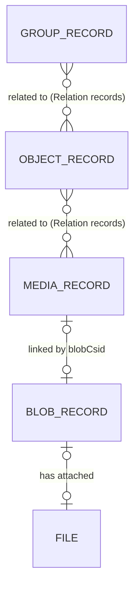
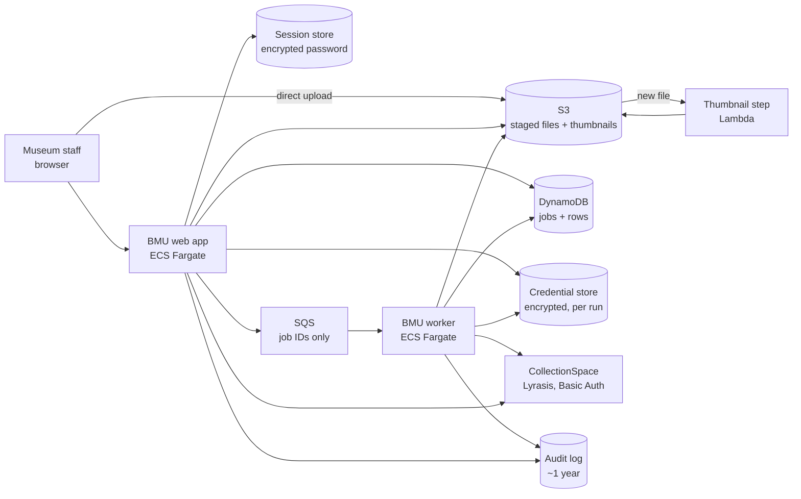
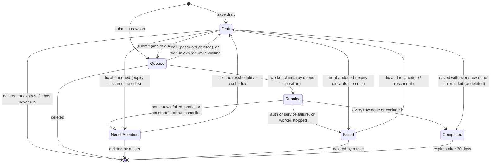
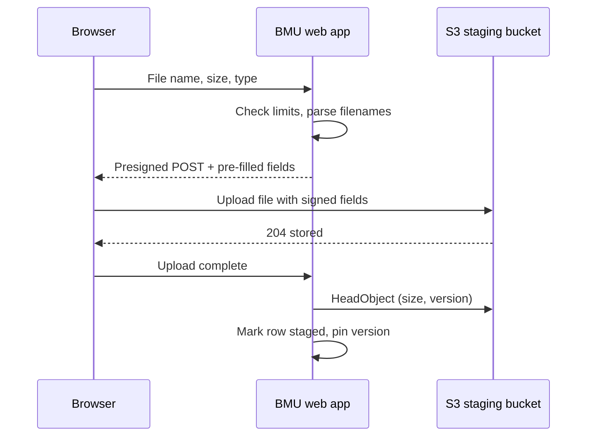

# New BMU (uploadmedia): High-Level Architecture

Richard Millet · started September 23, 2026 · for later changes see this file's history in git

> This file is the design document, and its only copy. Until October 5, 2026 it was a Claude document kept outside
> the repository. Change it through pull requests, together with the code it describes.

## Summary

The new Bulk Media Uploader (BMU) creates Media records, Blob records with their files, Object records and Relation records in CollectionSpace using each user's own CollectionSpace credentials, not a shared service account.

It runs as an AWS service: a web app for preparing and managing jobs, a queue, and a Fargate worker that executes jobs row by row. Job state lives in DynamoDB; staged files live in S3; passwords are held, encrypted with KMS, only during a login session and a job run.

Key decisions:

- **User credentials, never stored permanently.** A password is kept encrypted in the server-side login session while the user works, and in the job's credential record from submission until the run ends. Every queued or running job holds its submitting user's credentials; editing a queued job, logout, session expiry and every run outcome delete them.
- **Create-only.** The BMU never deletes, updates or cleans up anything in CollectionSpace. It finishes as much of each row as it can and reports what it did and didn't do.
- **Jobs are durable and fixable.** Failed rows stay visible. Fix and reschedule (or Reschedule, when nothing needs changing) moves a job back to Drafts; the rerun does only the unfinished steps. Rows that created nothing can be deleted; others can only be excluded from the job. A running job can be cancelled after the row in progress.
- **Drafts and an ordered queue.** Jobs can be saved as drafts, incomplete or with problems, visible to and editable by everyone in the tenant, one person at a time with take-over. Drafts expire after 30 days (7 if a row is protected); an abandoned fix reverts instead of being deleted. Submitted jobs wait in a per-tenant queue and start at the tenant's run times; staff can change the order (see Job scheduling and Roles).
- **Run history and plain-language failures.** Every run is recorded with who submitted it, when it ran, its outcome and counts; finished jobs explain each failure from a catalog of codes.
- **Retention.** Clean jobs are deleted 30 days after completion; jobs with failures stay until a user deletes them; a run audit log is kept about a year.
- **Protected files. Rows are marked as protected files** automatically when tenant configuration and CollectionSpace data show their Object is sensitive (never by hand); protected rows get restricted previews (no stored thumbnails) and faster cleanup. All uploads to CollectionSpace use multipart PUT, never presigned (blobUri) URLs.
- **Per-document handling and a 1,000-row UI.** Each document picks one of its tenant's handling options; tenant presets and a bulk-change panel fill the fields, which follow each tenant's legacy form plus Language; the editor pages, sorts and filters up to 1,000 documents with thumbnails.
- **Groups.** A job can create one new Group; every document linked to an Object joins it by default once its Media record is linked, and individual documents can be left out.

## Background: the legacy BMU

The legacy BMU (`uploadmedia` in cspace-webapps-common) acts in CollectionSpace as one shared account per tenant, so CollectionSpace cannot tell who did what.

- **Flow.** The Django app writes a `*.step1.csv` job file plus uploaded files to a shared directory. Cron runs `bin/bmu-run.sh`, which calls `postblob.sh` and then `uploadMedia.py` for each job file.
- **Credentials.** Every call uses HTTP Basic Auth as `bmu@<tenant>.cspace.berkeley.edu`. The password sits in plaintext in `/var/www/<tenant>/config/uploadmedia_batch.cfg`. Helper scripts `source` it into the shell and pass it to curl on the command line.
- **Order of creation.** Blob first, then Media, then Object (if needed) and Relations.

Problems this design fixes:

- **No per-user authorization.** Anyone who can reach the upload form, or write to the job directory, acts with the BMU account's full privileges.
- **No audit trail.** CollectionSpace attributes every record to `bmu@…`.
- **Plaintext secrets** on disk and in process listings.
- **Latency.** Jobs wait for the next cron run, up to about 12 hours.
- **Weak failure handling.** Failures are visible only in trace logs; there is no structured way to see, fix and rerun failed items.
- **SQL injection in Object lookup.** `getCSID` in `cswaExtras.py` queries Postgres directly, formatting the object number into the SQL string.

## CollectionSpace data model: Object, Media and Blob records

For developers: the BMU creates and links a few kinds of CollectionSpace record. This section defines them and the terms the rest of this document uses.

| Record | What it holds | How it is linked |
| --- | --- | --- |
| Object record (`collectionobjects`) | The catalog record for a museum object, specimen or document | To Media records and Group records, through Relation records |
| Media record (`media`) | Descriptive metadata: identification number, title, creator, media type, date, publishing flags | To zero or one Blob record through its `blobCsid` field; to Object records through Relation records |
| Blob record (`blobs`) | A file and its technical metadata (name, MIME type, size). CollectionSpace stores the file and generates derivatives, such as thumbnails, from it | Only by the Media record's `blobCsid`; a Blob record has no field pointing back to its Media record |
| Relation record (`relations`) | A one-directional link between two records. Each relationship is a pair, one in each direction | Refers to both records |
| Group record (`groups`) | A named set of records. The BMU's Group option relates Object records to one Group record | To Object records through Relation records |

**Object and Media records**

- An Object record can be related to zero or more Media records, and a Media record can be related to zero or more Object records. The BMU relates each new Media record to at most one Object record.
- A relationship is stored as two Relation records, not as a field on either record. Deleting an Object record does not delete its related Media records, and deleting a Media record does not delete its related Object records.

**Media and Blob records**

- A Media record is linked to zero or one Blob record, by the Blob record's CSID stored in the Media record's `blobCsid` field (`media_common`). The CollectionSpace UI never shows this field.
- In theory several Media records could hold the same `blobCsid`; in practice that never happens, and the BMU always creates a new Blob record for each new Media record.
- The Blob record a Media record points to never changes. The CollectionSpace UI has no way to unlink a Media record from its Blob record or to point it at a different one, and the BMU never does either. (Changing `blobCsid` is technically possible through the services API, which would leave the old Blob record orphaned; nothing in the UCB workflow does this.)
- The CollectionSpace UI does not let users view or edit Blob records, or change their files. A Blob record and its file are managed only through the Media record that points to it.
- A Media record does not necessarily have a Blob record. For example, a BMU row whose upload fails after its Media record was created leaves a Media record with no Blob record.
- A Blob record does not necessarily have a file attached.
- Deleting a Media record deletes its linked Blob record too.
- The BMU never modifies or deletes Blob records; it only creates them through `PUT media/{csid}/blob`. More detail on Blob records, for the curious, is in the appendix "Blob record internals"; none of it is needed to build the BMU.

**Files**

- In this document, a **file** is what is attached to a Blob record: the image, audio, video, 3D model or document the user uploads. Its **filename** becomes the Blob record's name and the Media record's `title`.

**How the BMU creates them, per row**

1. `POST media` creates the Media record.
2. `PUT media/{csid}/blob`, sent as a multipart upload of the file, creates a Blob record, attaches the file to it and sets the Media record's `blobCsid`, in one call. The BMU never adds the `blobPurgeOrig` query parameter, which would make CollectionSpace discard the original image and keep only its derivatives.
3. If the row relates to an Object record: find it, create it with `POST collectionobjects`, or find it and create it only if missing, as the row's handling says; then create the pair of Relation records with `POST relations`.
4. If the job creates a Group: create the Group record once per job with `POST groups`, then relate to it the Object record of each included row once that row's Media record is related to its Object.

**Terms used in this document**

| Term | Meaning |
| --- | --- |
| Object record | A `collectionobjects` record |
| Media record | A `media` record |
| Blob record | A `blobs` record |
| File | What is attached to a Blob record; what the user uploads |
| Related to | Connected by a pair of Relation records (Object, Media and Group records) |
| Linked | A Media record's `blobCsid` pointing to a Blob record |
| Row | One line of a BMU job: one new Media record, the Blob record for its file, and optionally a relationship to one Object record |

## What the BMU does

Each row of a job creates one new Media record and a Blob record holding the uploaded file, and optionally relates the Media record to an Object record, existing or new.

The UI lets the user specify, per row:

- the Media record's fields and the file to upload;
- whether to relate the Media record to an Object, and which one, by object number;
- whether to create that Object record if it does not exist.

| Row type | CollectionSpace calls | Permissions the user needs |
| --- | --- | --- |
| Media only | `POST media`; `PUT media/{csid}/blob` (creates the Blob) | Create, read and update on media; read on the Person or Organization authority of any filled creator, contributor or rights holder |
| Media related to an existing Object | The above; search collectionobjects by object number; `POST relations` twice | The above, plus read on collectionobjects and create on relations |
| Media related to a new Object | The above; `POST collectionobjects` (an Object that already exists blocks the row) | The above, plus create on collectionobjects |
| Media related to an existing Object, or a new one if missing | The above; search collectionobjects, then POST collectionobjects if not found | The above for an existing Object (read on collectionobjects and create on relations), plus create on collectionobjects only when the Object is missing |
| Group of Objects (job option) | `POST groups` once per job; `POST relations` twice per Object | Create on groups and create on relations |

The BMU checks these permissions dynamically, with the user's own CollectionSpace credentials, against what each row actually asks for (see Authentication).

**Groups (job option)**

A job can optionally create a CollectionSpace Group record containing the Objects its rows relate to, as the legacy BMU does.

- **Turning it on.** The job header has a "Create a group of this job's objects" checkbox. When it is on, a Group title is required. It starts empty and is not derived from the job name: the job name is a working label inside the BMU that goes away with the job, while the Group title names a CollectionSpace record that stays and that curators search for. The user types a title, or fills it with one click: **Use the job name** (the job name exactly as typed) or **Use a timestamp** (`bmu-YYYY-MM-DD-HH-MM-SS`, Pacific time, like the legacy `=job` convention, which named the Group after the legacy job's timestamp number). Renaming the job never changes the title. When it is off, no Group is created. This replaces the legacy rule where a blank title field meant no Group.
- **Always a new Group.** Each job creates at most one new Group record, reused by all its reruns (see The Group step). The BMU never adds to a Group that already exists in CollectionSpace; that is done in the CollectionSpace UI. Once a run has created the job's Group, the checkbox, the Group title and its fill buttons are locked when the job is reopened, saying which run created it and its CSID: the Group can't be turned off or renamed from the BMU.
- **Which Objects join.** Every row linked to an Object is in the Group by default. A per-row Group checkbox, and the side panel for many rows, can leave a row out. Rows with no Object (media only) cannot join.
- **When an Object joins.** Only after the row's Media record is created and related to its Object, as in the legacy BMU. A row whose Media create failed adds nothing to the Group, so it stays deletable if it created nothing else. An upload failure does not stop the Object joining, because the Media record exists and is related.
- **Objects only.** The Group is related to Object records, not Media records, matching the legacy behavior (a Media group option exists in the legacy UI but is commented out).
- **Each Object once.** An Object is added once even if several rows relate to it, with a Relation in each direction between the Group and the Object.
- **No empty Groups.** The Group is created only when the first row is ready to add its Object, so a job in which no row reaches that point creates no Group.
- **Legacy form.** PAHMA, the Botanical Garden and UCJEPS fill the legacy `group_title` column from a text field labelled "Group (group title), if desired" (UCJEPS: "Folder (group title)"); a separate "make a group" checkbox in the legacy UI, which stresses that the group is of the objects and not the media, does not appear to be connected. The new BMU calls the field Group title (UCJEPS: Folder (group title)), the name legacy users and CollectionSpace's Group record use, and puts "of this job's objects" on the checkbox instead. BAMPFA and Cinefiles have no Group field today; the new BMU offers the option to every tenant whose handling links to Objects.

## Handling per document

Handling is chosen per document, not per job: each row picks one of its tenant's handling options, and a job can mix them. This replaces the legacy handling types, which forced one choice on a whole job.

**What a handling option sets**

| Setting | Values | Example |
| --- | --- | --- |
| Object behavior | none · existing only · create only · existing or create | "Create new object + link" only creates the Object record; "Link to object (create if missing)" links to it if found and creates it otherwise |
| Identification number rule | object number · image number · generated (`DP-<year>-<counter>`) | PAHMA "Media only" uses the image number |
| Field presets | Default media type, contributor, copyright statement | UCJEPS "Slide" presets type Slide (Photograph) |
| Label | What users see in the list | "Link to existing accession" |

Handling options are tenant configuration. Presets must resolve to values in the tenant's option lists, vocabularies and authorities; they fill a row's fields but never overwrite a field the user has edited, and are marked as presets in the UI.

**Options per tenant** (from each tenant's current `uploadmedia.cfg`)

| Tenant | Handling options |
| --- | --- |
| PAHMA | Link to existing object · Link to object (create if missing) · Create new object + link · Media only (no object), whose ID is the image number |
| BAMPFA | Link to existing object (only option) |
| Botanical Garden | Link to existing accession · Media only (no accession) · Born-digital (DP number). "Accession" is the Garden's name for its Object (CollectionObject) record, whose object number its UI labels "Accession number"; the BMU links the Media record to that CollectionObject, as the legacy BMU does. It is not CollectionSpace's separate Acquisition procedure. |
| UCJEPS | Link to existing object · Create new object + link · Media only (no object) · Slide · Born-digital (DP number) |
| Cinefiles | Link to existing object (only option) |

When a tenant has one option, the Handling column is read-only. A handling that needs a permission the user lacks (for example "Create new object" without create on collectionobjects) is shown but cannot be chosen.

**Setting handling**

- Per row, in the Handling column, or for many rows at once from the bulk-change panel (see User interface).
- Changing handling re-evaluates the row: identification number, whether Group is available (only rows related to an Object record can join the job's Group), presets and validation.
- The legacy `alwayscreatemedia` setting has no equivalent: its code never took effect. With "Link to existing object", a missing Object record blocks submitting; the user corrects the object number, picks another handling, or excludes the row from the job. "Create new object + link" only creates: an Object record that already exists blocks submitting, and the user switches to "Link to existing object" or "Link to object (create if missing)", or corrects the object number. "Link to object (create if missing)" is new (the legacy BMU has no such type): it links to the Object record if one exists and creates it otherwise, so it needs create on collectionobjects only for rows whose Object is missing.

## Pre-filling rows from filenames and EXIF

When files are chosen, the BMU pre-fills each row's object number, image number and date from the filename and the file's EXIF metadata (image files only), using per-tenant rules; the user can review and correct every value.

**Legacy filename rules** (`getNumber.py`)

| Tenant | Example filename | Parsed as |
| --- | --- | --- |
| BAMPFA | `bampfa_1995-46-194-a_199.jpg` | Strip `bampfa_`; split on `_` into object number and image number (a third part, image type, is ignored); hyphens become dots, except that a hyphen after a run of letters is kept |
| PAHMA | `1-2345_01.tif` | Object number: text before the first `_`. Image number: text before the first `.` (used by the "mediaonly" option) |
| UCJEPS | `UC1107670_a_nice_pic.JPG` | Object number: text before the first `.` or `_` |
| Cinefiles | `56306.p3.300gray.tif` | Object number: first `.`-part; image number: second part without `p` |
| Botanical Garden | `12.1234_1_CL.jpg` | Accession number, image order (or "label" for a label image), creator initials; later parts ignored. Initials map to a creator term (see Creator initials under User interface) |
| Default | anything | Text before the first `_`, minus the file extension |

PAHMA in the new BMU keeps the legacy object number (the text before the first `_`, so filenames with several `_` parts parse), but its image number, used by "Media only", is the whole filename without its extension. Legacy cut the image number at the first `.`, which truncated PAHMA's dotted numbers (`9-12345.1.2_3.jpg` gave `9-12345`); this is a deliberate change. The object number may contain only letters, digits, "." and "-" (and must start with a letter or digit), and anything after the first "\_" only letters, digits, ".", "\_" and "-"; a filename with other characters, such as spaces, doesn't parse, and the row shows "Fix filename" until the file is renamed in the BMU (renaming enforces safe characters) or the object number is entered.

**Supported file types**

All tenant rules accept the same file types, and the file extension is stripped before parsing: images (JPEG, TIFF, PNG), PDF documents, audio (WAV, MP3, AAC), video (MP4) and 3D models (X3D). This is the legacy BMU's list plus PDF, which every tenant accepts. Files of other types are skipped when they are added: they are never uploaded, and a message above the table names them. The file picker offers only these types and the drop zone lists them; the row check ("of a supported type") remains as a backstop. The same list sets the allowed content types for uploads and the file-type check in the worker.

**EXIF**

EXIF applies to image files only. The legacy BMU reads each image file's EXIF data on the server and uses `DateTimeDigitized` to fill the row's date when it is blank.

**In the new design**

- **Filenames are parsed on the server.** The browser already sends each file's name, size and type when it requests upload permission, so the web app applies the tenant's filename rule then and returns the pre-filled object and image numbers together with the presigned uploads. Each tenant's rules are implemented once, in one place, and nothing from the browser needs trusting.
- **Rules are configuration, not code.** Each tenant's filename rule is a declarative pattern (a regular expression with named parts, plus simple transforms such as "hyphens to dots"), stored in tenant configuration. Adding a tenant or changing a convention needs no code change.
- **EXIF is read in the browser.** EXIF is inside the file, which never passes through the web app. The page reads it locally from JPEG and TIFF files, reading only small ranges of the file, and sends only the needed fields with the file's name and size: the date (DateTimeDigitized, else DateTimeOriginal, else DateTime) and the orientation (portrait, landscape or square, from the pixel size turned by the EXIF Orientation tag). The server validates them like any other user input.
- **Only needed fields are kept.** The BMU extracts only the EXIF fields it uses (the date and orientation); other metadata such as GPS stays inside the uploaded file and is not copied into BMU records or logs.
- **Values stay editable.** Pre-filled values are suggestions: they are validated (object lookup, date format) like any user input, and a parsing failure never stops the upload: the file still uploads, the object number is left blank with a note, and the row needs fixing (it blocks submitting) until someone fills in the object number, renames the file, or picks a handling that doesn't need one.

## Authority term fields

The Media record's `creator`, `rightsHolder` and `contributor` fields hold references (refNames) to Person or Organization authority terms, and the BMU edits them the way the CollectionSpace UI does: with autocomplete against the live authorities.

**What CollectionSpace does**

- The schema types these fields as plain strings; the refName convention comes from the UI. In `cspace-ui.js` each is an autocomplete field searching local and shared Person and Organization authorities. UCJEPS narrows the sources to local persons, local organizations and its "institution" organization vocabulary. PAHMA keeps the default source list (person/local, person/shared, organization/local, organization/shared), but its profile configures no "shared" Person or Organization vocabulary (cspace-ui defines local and ULAN, and PAHMA disables ULAN), so its UI searches local ones only, and so does the BMU. scripts/check\_cspace.py --vocabularies lists the vocabularies a server actually has. Confirmed on PAHMA's QA server (September 29): Persons has person and ulan\_pa, Organizations has organization and ulan\_oa, and neither has a shared vocabulary; the ULAN ones are disabled in PAHMA's UI and not in the Media fields' sources.
- Autocomplete calls the authority's items endpoint with a partial term, for example `GET personauthorities/<vocabulary>/items?pt=<text>&wf_deleted=false`, and stores the chosen item's refName.
- The legacy BMU instead offers short dropdowns of hardcoded refNames from `uploadmedia.cfg`, which go stale when people or organizations change.

**In the new BMU**

- **Autocomplete through the web app.** The browser sends the typed text to the web app, which searches the configured authorities with the user's session credentials and returns display names and refNames. The browser never talks to CollectionSpace directly. Its behavior matches the CollectionSpace UI, as listed below.
- **Per-tenant sources.** Each field's authority sources are taken from the tenant's CollectionSpace UI configuration, as described below.
- **Presets and bulk changes, not job-level defaults.** A tenant can configure a preset per handling option, such as its own organization as contributor, replacing the legacy constants; new rows get the preset, marked as such. To set the same creator, rights holder or contributor on many documents, the user picks it once in the side panel and applies it to the selected documents or to all; the value is copied into each row. Every row holds its own value, which is exactly what is sent. For authority fields (creator, contributor, rights holder) that value is always the term's full refName, whether it came from a preset, the side panel, creator initials or the autocomplete; the UI shows only the display name part. Nothing is inherited later: changing a preset or the panel does not change rows already filled.
- **Validation.** A value is accepted only as a refName chosen from the authorities; free text is not saved into these fields. The validation-while-editing checks confirm that each row's terms still exist, and so that presets, which fill rows, still resolve. The web app looks up each distinct refName in its authority once per check; a term that was deleted, or is gone (merged), blocks the row: “Creator “John Adams” no longer exists in CollectionSpace (it was deleted, or merged into another term). Choose another creator.” When the value came from a preset, the message adds: “It was filled in from PAHMA’s preset, so the preset needs updating too: tell the BMU administrator.” A lookup that fails only warns (“Couldn't check …”); it never reports a term as missing. Rows whose Media record already exists aren't checked again. A renamed term keeps its short identifier, so it still exists, but the row's refName carries the old display name, and that is what the Media record would store: in a draft the row takes the term's current refName, with a note (“Creator “Leslie Freund” was renamed in CollectionSpace; this document now uses its current name, “Leslie F. Freund”.”); a queued job isn't changed by the web app, and its preview says the job will use the new name when it runs. The worker checks the same values again when a run starts and just before creating each document (see Job execution): a renamed term is used under its current name, and a document whose value no longer exists fails with value\_missing before anything is created for it. scripts/check\_cspace.py --terms reads terms the same way and prints what CollectionSpace returns and what the BMU concludes.
- **Permissions.** Searching needs read permission on the Person and Organization authorities (`personauthorities`, `orgauthorities`), added to the permission checks. A filled field whose authority the user can't read blocks the row, because its term can't be checked.
- **Adding new terms.** Unlike the CollectionSpace UI, the BMU's autocomplete does not offer to create new authority terms; users pick existing terms only. A missing person or organization is added in the CollectionSpace UI first. So the BMU never needs create permission on authorities.

**Behavior matched to the CollectionSpace UI**

The implementation follows the UCB fork of the UI, `cspace-deployment/cspace-ui.js` (version 10.2.0-ucb.1, used by all UCB tenants), specifically `AutocompleteInputContainer` and `actions/partialTermSearch.js`, in everything except adding new terms. Its search logic is identical to upstream `collectionspace/cspace-ui.js` 11.0.0.

| Behavior | CollectionSpace UI | BMU |
| --- | --- | --- |
| Type-ahead | Searches after at least 3 characters (`autocompleteMinLength`), 500 ms after typing stops (`autocompleteFindDelay`) | Same values, read from the tenant's UI configuration. cspace-ui's defaults are 3 characters and 500 ms; PAHMA's profile sets a 1,000 ms find delay (autocomplete in the tenant configuration) |
| Query | One request per source: `GET <authority>/<vocabulary>/items?pt=<text>&wf_deleted=false` | Same, sent by the web app with the user's credentials |
| Deleted terms | Excluded with `wf_deleted=false` | Same |
| Multiple sources | A field's `source` lists several authority/vocabulary pairs (for example `person/local,person/shared,organization/local,organization/shared`); each is searched and results are grouped by source | Same grouping. The prototype heads the groups Persons and Organizations, not with the UI's source names |
| Source permissions | Sources the user cannot list are dropped silently | Same, using the user's cached permissions |
| Unconfigured vocabularies | A source with no configured service path (for example a shared vocabulary not set up for the tenant) is skipped | Same |
| Many matches | Only the first page of each source's results is fetched and the list shows the match count (upstream 11.0.0 also adds a "Continue typing to narrow results" hint; the UCB fork does not yet) | Same: no paging through results; shows the count and the narrowing hint, so users know to type more |
| Adding terms | Offers "Add ... to ..." for sources the user can create in | Not offered |

**Taking the configuration from the CollectionSpace UI**

- A tenant's UI configuration is the UCB fork `cspace-deployment/cspace-ui.js` plus the tenant's profile plugin, both in the `cspace-deployment` GitHub organization: `cspace-ui-plugin-profile-pahma.js`, `-bampfa.js`, `-ucbg.js` (Botanical Garden), `-ucjeps.js` and `-cinefiles.js`. The deployment page in `cspace-deployment/services` adds no overrides of its own.
- A build step loads the same versions of `cspace-ui.js` and the tenant's profile plugin that the tenant runs, merges their configuration as the UI does, and extracts for each Media authority field its `source`, the service paths of each authority and vocabulary, and the autocomplete timing settings. The result is stored as that tenant's BMU configuration. The prototype doesn't have this step: PAHMA's configuration is written by hand from the legacy BMU's settings and the PAHMA profile, and nothing checks it against the running UI.
- So however a tenant's UI is configured for, say, the Media record's Contributor field, the BMU's Contributor field uses the same sources. When a tenant upgrades its UI or profile plugin, rerunning the build step picks up the change.
- The extraction is limited to the fields the BMU edits, so other UI configuration never affects the BMU.

## Media record fields

The new BMU sends only the Media record fields the legacy BMU sends (see the appendix), with two changes: the Blob reference is set by the upload rather than sent, and the date is parsed the way the CollectionSpace UI parses it. Field types below are from the UCB UI (`cspace-deployment/cspace-ui.js` plus each tenant's profile).

**No hard-coded list items.** The BMU's code contains no list values of any kind. Every choice a user can make comes from one of three places, as it does in the CollectionSpace UI:

| Kind of list | Examples | Where the values come from |
| --- | --- | --- |
| Option lists | Media type, `postToPublic` yes/no, `websiteDisplayLevel` | The tenant's UI configuration (`cspace-deployment/cspace-ui.js` plus profile), extracted by the build step, with their display labels |
| Vocabularies | Language | CollectionSpace at run time: `GET vocabularies/urn:cspace:name(<vocabulary>)/items?pgSz=0&wf_deleted=false`, the same call the UI makes |
| Authorities | Creator, rights holder, contributor | CollectionSpace at run time, by autocomplete (see Authority term fields) |

Defaults, such as a job type's media type or the language, are tenant configuration, not code, and are checked against these sources: a row whose language is no longer in the languages vocabulary, or whose media type isn't in the tenant's option list, is blocked with a message saying which value to replace. Any example values quoted in this document are illustrations of current configuration, not values the BMU contains.

**No new list items or terms.** Users can only choose existing values: the BMU never creates an option-list item, a vocabulary term or an authority term, even though the CollectionSpace UI can add vocabulary and authority terms from its pickers. A missing value is added in CollectionSpace first. Choosing more than one value for a repeating field, such as a second media type, is allowed; it picks another existing value, not a new one. As a result the BMU never needs create permission on vocabularies or authorities.

**`media_common` (all tenants; source only for the tenants that edit it, which PAHMA doesn't)**

| Schema path | Value | Type in the UI |
| --- | --- | --- |
| `title` | The document's filename: the cleaned name, or the new name if it was renamed | Text |
| `identificationNumber` | Object number (PAHMA "media only": image number) | Text |
| `description` | User text (PAHMA's legacy form labels it "Contributor") | Text |
| `creator`, `rightsHolder`, `contributor` | Chosen terms | Authority refName (see Authority term fields) |
| `typeList/type` | Media type | Option list, repeating (`mediaTypes`; PAHMA `pahmaMediaTypes`) |
| `copyrightStatement` | Copyright text | Text |
| `source` | Source | Text |
| `languageList/language` | Chosen from the `languages` vocabulary; default from tenant configuration (English for every tenant, as the legacy BMU sends); editable and repeating like media type, per row or with the side panel; required, so an empty Language is a Must fix (what the row shows is what is sent) | Vocabulary term refName, repeating (`languages`, loaded from CollectionSpace) |
| `dateGroupList/dateGroup` | Date, parsed (below) | Structured date, repeating |

**Tenant extensions**

| Schema path | Tenants | Type in the UI |
| --- | --- | --- |
| `media_pahma/approvedForWeb` | PAHMA | Boolean |
| `media_botgarden/postToPublic`, `media_ucjeps/postToPublic` | Botanical Garden, UCJEPS | Option list (`yesNoValues`) |
| `media_<tenant>/primaryDisplay` (false) | PAHMA, BAMPFA | Boolean |
| `media_bampfa/imageNumber`, `media_botgarden/imageNumber` | BAMPFA, Botanical Garden | Integer |
| `media_cinefiles/page` | Cinefiles | Integer |
| media\_bampfa/websiteDisplayLevel, media\_cinefiles/websiteDisplayLevel | BAMPFA, Cinefiles | Option list (website display levels); their publish field, shown as "Website display". Pending: the mapping is an open question |

Option-list and vocabulary values are checked against the tenant's UI configuration, taken by the same build step as the autocomplete sources, so the BMU never sends a value the UI does not recognize.

**Editable fields per tenant**

Rule: a tenant can edit the fields its legacy BMU form offers, plus the values the legacy BMU fills in automatically, which become editable presets. Every tenant also edits the filename, identification number, object number, date and its publish field (see the tenant extensions table above, and Protected files for each tenant's publish rules). PAHMA's publish field is shown as a Restricted checkbox, the inverse of approvedForWeb: Restricted checked sends approvedForWeb = false, unchecked sends true. It defaults to unchecked, and to checked for protected rows. Taken from each tenant's `uploadmedia.cfg` in `cspace-deployment/cspace-webapps-ucb` (`overrides` for the form, `bmuconstants` for the per-handling values).

| Tenant | From the legacy form | From legacy automatic values (editable presets) | Language |
| --- | --- | --- | --- |
| PAHMA | Creator, description (labeled "Contributor" on the legacy form), rights holder | Media type, contributor, copyright statement; no preset values, because PAHMA's are blank | Default English |
| BAMPFA | None | None | Default English |
| Botanical Garden | Creator (also set from creator initials in the filename), source, description, rights holder | Media type `still_image`; contributor UC Botanical Garden; copyright statement for born-digital | Default English |
| UCJEPS | Creator, rights holder, source (locality is pending) | Media type Slide (Photograph) for slides, Digital Image for born-digital; contributor University and Jepson Herbaria Image Collection and copyright statement for slide and born-digital; no presets for other handling | Default English |
| Cinefiles | None | None | Default English |

- The Botanical Garden form's "Type" dropdown never reached CollectionSpace (see the appendix); its media type field replaces it.
- Preset values are tenant configuration checked against the tenant's lists and authorities, not code.

**Blob reference**

The legacy BMU sends `blobCsid` in the Media create. The new BMU creates the Media record first and uploads the file with `PUT media/{csid}/blob`, so CollectionSpace creates the Blob record and sets the Media record's blobCsid itself and `blobCsid` is not sent.

**Filenames**

The filename comes from the user's browser but ends up stored in CollectionSpace twice: as the Media record's `title`, and as the Blob record's name, which CollectionSpace takes from the filename in the multipart upload and shows as the file's name in its UI and downloads. So the BMU treats it as untrusted input:

- **Cleaned once, on the server.** When the browser first reports a file, the web app strips any path, removes control characters, rejects names that are empty, start with a dot or contain `..`, caps the length and keeps the extension. The cleaned name is stored on the row.
- **One name everywhere.** The cleaned name is what the filename rules parse, what the worker sends as `title`, and what it sends as the upload's filename. The browser's original string is never sent to CollectionSpace.
- **Not in S3 keys.** Staged files keep random keys, as described under Browser uploads.
- **Treated the same regardless of sensitivity.** Filenames of protected rows are shown in the BMU, recorded in its logs and audit log like any other row, and stored in CollectionSpace as the title and Blob name, protected by CollectionSpace's permissions.

The cleaning also guards CollectionSpace itself: the services write each upload to a temporary folder using the filename exactly as received (`FileUtilities` in `collectionspace/services`), so a name containing path characters could be written outside that folder.

**Born-digital identification numbers**

Rows with born-digital handling (Botanical Garden, UCJEPS) get a generated identification number instead of one parsed from the filename. The BMU keeps the tenants' `DP-` convention but makes the numbers guaranteed unique.

- **Legacy mechanism.** `DP-` + the web server's local time when the upload was submitted (`YYYY-MM-DD-HH-MM-SS`) + the file's four-digit position in the upload, for example `DP-2015-10-08-12-16-43-0001`. Two uploads in the same second produce the same numbers, the autumn clock change repeats an hour, and nothing checks CollectionSpace before the record is created.
- **New format.** `DP-<year>-<counter>`, for example `DP-2026-001042`: a per-tenant counter, six digits and zero-padded, that restarts each year. It cannot collide with legacy numbers, whose format differs.
- **Counter.** One DynamoDB item per tenant and year, incremented atomically. When a job is submitted, the web app reserves one number for each of its born-digital rows in a single update and stores them on the rows. Numbers are never reused, so a deleted row leaves a gap; that is acceptable.
- **Reruns and editing.** A row keeps its reserved number across reruns. Before submitting, the editor shows a preview of the next numbers, labeled as generated. If a user edits the number, it is treated like any edited identification number, including the duplicate check.
- **Check before create.** The worker still runs the duplicate-identification-number check before creating each record, as a safeguard.
- **Comparison with the CollectionSpace UI.** The UI offers CollectionSpace's own Media ID generator ("Media Resource", numbers like `MR2026.123`). The BMU does not use it for born-digital rows, to keep the `DP-` convention.

**Media type**

The BMU edits `typeList/type` the way the CollectionSpace UI does, instead of the legacy fixed constant per handling type.

- **Same input.** In the UI it is an option picker (`OptionPickerInput`) over an option list, and it repeats, so a record can have more than one type. The BMU offers the same picker, same repeating behavior, same values and same display labels.
- **Same list.** Core uses `mediaTypes` (dataset, document, moving\_image, still\_image, sound). PAHMA uses its own `pahmaMediaTypes` (document, image, slide, audio, video); UCJEPS extends `mediaTypes` with values such as Digital Image, Illustration, Scanned Photograph and Slide (Photograph). The BMU takes each tenant's list and labels from its UI configuration with the same build step as the autocomplete sources.
- **Stored value.** As in the UI, the option's value is saved, not its label.
- **Defaults.** The legacy per-handling-type constants become presets per handling option, and the user can change the type per row or for many rows with the side panel. The existing constants (still\_image, Digital Image, Slide (Photograph)) are all values in the current lists, so they carry over unchanged; the build step flags any default that is not in the tenant's list.

**Structured dates**

The legacy BMU fills only `dateDisplayDate`, so its dates may not work in date searches. The new BMU parses dates as the CollectionSpace UI does:

- The UI sends the display text to the services endpoint `GET structureddates` and fills the date group from the result: earliest and latest year, month, day, era, certainty and qualifiers, plus the scalar values used for searching. The parser is CollectionSpace's own (`StructuredDateInternal.parse` in the services).
- The BMU's web app calls the same endpoint with the user's session credentials whenever a row's date changes, and stores the parsed date group on the row. The worker sends the full group.
- The UCB UI uses the endpoint's older `dateToParse` form and computes the scalar values in the browser; the `displayDate` form returns the same parse with the scalar values already computed, in the same shape as the record. The BMU uses `displayDate`, with the same result.
- EXIF dates look like `2019:05:12 14:33:00`; the BMU converts them to `2019-05-12` before parsing.
- If parsing fails, the row needs fixing (it blocks submitting) until the date is corrected or cleared, and the field shows "Can't interpret this date". This is stricter than the CollectionSpace UI, which only warns and saves such a date as display text: a date that date searches can't find is treated as an error, not a warning. If CollectionSpace can't be asked, the row also needs fixing until the date can be checked, because the worker doesn't parse dates again; other lookups that can't be made only warn.
- The endpoint is checked like any other request, so read permission on `structureddates` is needed; UI users normally have it.

**Legacy fields that do not match the UCB UI (to address)**

- `approvedForWeb` is sent to `media_bampfa` and `media_cinefiles`, but neither tenant's UI has it; both use `websiteDisplayLevel`.
- `primaryDisplay` is sent to `media_cinefiles`, but Cinefiles defines it in `media_piction`; UCJEPS's Media profile has no `primaryDisplay`.
- UCJEPS locality is sent as `media_ucjeps/localityGroupList/localityGroup/fieldLocVerbatim`, but UCJEPS defines locality only on Objects.

Legacy jobs succeed, so CollectionSpace apparently ignores these elements and their values were probably never saved. Each needs a decision (listed under Open questions) before the new BMU sends it.

## Goals, non-goals and constraints

**Goals**

- Create records in CollectionSpace as the user who submits or resubmits the job, so CollectionSpace roles and audit fields apply.
- Never store CollectionSpace passwords permanently; encrypt them while held; delete them when a run ends.
- Process each row as completely as possible, and show per row what was created and what failed.
- Let any valid user in the tenant view jobs, staff edit, resubmit and clean them up, and interns prepare drafts (see Roles).
- Run jobs at each tenant's run times, which staff set and can override per job (Run now, a job's own run time), instead of a fixed nightly cron.

**Non-goals**

- Deleting, updating or cleaning up records in CollectionSpace. The BMU is create-only.
- Cleaning up orphaned records. That belongs to a separate CollectionSpace Batch job.
- Editing records after they exist in CollectionSpace.
- Link-only rows (relating existing Media to existing Objects without a new file) and creating Media for Blobs already in CollectionSpace. The legacy helper scripts `linkMedia.py` and `createAndLinkMedia.py` are not carried over.

**Constraints**

- CollectionSpace instances are hosted by Lyrasis and support **HTTP Basic Auth only**.
- Order of creation within a row: create the Media record first, then upload the file with a PUT to that Media record, which creates the Blob record and links it. A Blob record is never created without its Media record.
- Hosted on AWS, the team's standard infrastructure.

## Architecture overview

The BMU is a web app and a worker sharing DynamoDB and S3, connected by an SQS queue that carries only job IDs.

The web app talks to CollectionSpace only to read: it validates credentials, fetches permissions, looks up Objects and Media identification numbers, searches the authorities, loads vocabularies such as languages, parses dates with the structured-date parser, and fetches derivative thumbnails of files already in CollectionSpace. All record creation happens in the worker.

| Component | Responsibility |
| --- | --- |
| Web app (ECS Fargate) | Login, job preparation and editing, presigned upload URLs for direct browser-to-S3 uploads, credential validation and permission check, job submission, and the tenant's schedule and job queue |
| SQS queue | Signals the worker that queued work exists (job order comes from each job's queue position, not SQS); never carries credentials or metadata |
| Worker (ECS Fargate) | Claims a job, decrypts the password, runs rows step by step, records results, deletes credentials |
| DynamoDB: jobs table | One job item plus one item per row (see Job data model) |
| DynamoDB: credential table | Encrypted password per queued or running job; no backups or point-in-time recovery |
| DynamoDB: audit log | Run, submission, move-to-Drafts, take-over, cancel, completion, deletion, expiry, sign-in-expired, reverted-fix, cleanup, initials, schedule and queue entries (see Retention and audit), plus the CSID index; 365-day TTL; put-only writers; point-in-time recovery on |
| S3 | Staged files per job and row; per-row audit detail for large runs |
| KMS | Customer-managed keys: a session key and a job key for credential envelope encryption, and a staging key per museum for the staging bucket (decided 7 October 2026; one shared staging key until it is built; see One deployment for several museums) |
| Stream handler (Lambda) | Not needed while the worker's sweeper expires jobs (it writes the audit entry, then deletes the job's rows, staged files and thumbnails). Kept as an option only if a TTL is later added on the jobs table as a backstop |
| Sweeper (periodic) | Deletes stale credentials (a running job's too, past its limit), moves queued jobs whose sign-in expired to Drafts, reverts abandoned fixes, expires drafts and Completed jobs (audit entry first, then rows, staged files and thumbnails), ends runs whose worker stopped, removes protected files' staged uploads and finishes interrupted deletions |
| Session store | Server-side login sessions: username, tenant, cached permissions, password encrypted with the session key; TTL = absolute timeout |
| Thumbnail step (Lambda) | Makes a metadata-free JPEG thumbnail for each staged TIFF when it lands in S3, skipping protected rows; stores it under the job's prefix |

**Request flow**

1. A user chooses their museum and logs in (see One deployment for several museums). The web app validates the credentials by reading the account's permissions from CollectionSpace, reads its roles (BMU\_Staff or BMU\_Intern; see Roles), then creates a server-side session holding them, with the password encrypted.
2. The user prepares or edits a job: uploads files from the browser directly to S3 and fills in rows. The browser makes thumbnails for JPEG and PNG and sends them to the web app, which checks and re-encodes them before storing them; for TIFF, the thumbnail step makes one when the file lands in S3. Protected rows get no stored thumbnail. The UI checks each row's choices against the user's permissions as they go.
3. The user submits the job (or saves it as a draft to finish later). The web app re-checks permissions for the whole job, moves the password from the session into the job's credential record under the job key, sets the job to *queued*, and sends the job ID to SQS.
4. At the tenant's next run time (or when a staff member uses Run now), the worker claims the job in queue order, decrypts the password, and processes each row.
5. At the end of the run the worker deletes the credentials, records the results and writes the audit entry (one transaction), and sets the job's final status.

## Authentication, credentials and authorization

A password lives in two places only, both encrypted: the user's server-side login session while they prepare or edit jobs, and the job's credential record from submission until the run ends.

**Login and session**

- Login validates username and password, on the CollectionSpace of the museum chosen on the sign-in page, with one authenticated GET of the account's permissions (accounts/0/accountperms) on the tenant's CollectionSpace services endpoint, then reads the account's roles (accounts/0/accountroles) to find its BMU role, BMU\_Staff or BMU\_Intern; a user with neither, or a staff account without the permissions staff need, is refused (see Roles).
- On success the BMU creates a server-side HTTP session. The browser cookie holds only a random session ID (HttpOnly, Secure, SameSite=Strict), and the BMU stores only a SHA-256 hash of it. Every request that changes something must carry an X-BMU header, which a cross-site form can't send; without it the web app answers 403.
- The session record holds username, tenant, the cached permissions, the user's BMU role, and the password encrypted with a dedicated **session KMS key**. It lives in its own store (a DynamoDB table with point-in-time recovery off, or ElastiCache with no persistence), with a TTL equal to the absolute session timeout.
- Idle and absolute timeouts bound how long a password sits in the session store. Logout or expiry deletes the session record. Signing out also stops editing any draft the session had open; the draft stays in Drafts, saved, since every change is saved as it is made.
- A session allows viewing jobs, run history, and row status; for staff, also editing, submitting and rescheduling (Fix and reschedule or Reschedule); cancelling a running job (any staff member); deleting rows that created nothing; and deleting drafts, queued jobs and jobs that need attention or failed. An intern creates drafts and edits the drafts that are open to interns (see Roles). All of this is limited to the user's own tenant.

**Dynamic permission checks**

- As the user builds or edits rows, the web app checks the cached permissions against what each row asks for (see What the BMU does). For example, "Create new object + link" requires create on collectionobjects, and "Link to object (create if missing)" requires it when the row's Object is missing; without it the UI blocks that choice and says why.
- Rule: a row is blocked when its handling or its values need a permission the user lacks, whether for an action or for a check. Read on media is needed by every row (the identification-number check). Read on the Person or Organization authority is needed when creator, contributor or rights holder holds a term from it; empty fields need no check. Read on structureddates is needed when a date is filled, because CollectionSpace's date parser checks it. "Link to object (create if missing)" needs create on collectionobjects only when the Object is missing. Handling options that need a missing permission are shown as "(no permission)" and cannot be chosen, with one exception since October 2026: "Create new object + link" stays available to a user who can't create Objects, marked "(needs an Object creator)", and a document that needs a new Object is not blocked but shown as "Needs an Object creator"; a missing permission to create groups is one message for the job, not a block on its documents (see Roles, Three kinds of result). Interns are not held to their own permissions at all. Creating or editing a job at all needs create and update on media. Since the roles work (October 2026) a staff account without them, or without create on relations or the read permissions, can't sign in at all, with a message to contact the CollectionSpace administrator (see Roles); before that, such a user could view jobs but not change them.
- The permissions come from `GET accounts/0/accountperms` (verified), fetched with the session's credentials. CollectionSpace maps HTTP methods to actions (POST create, GET read, PUT update), so the check compares each needed call with the user's action groups.
- At submission, the web app re-fetches permissions and re-checks the whole job, since roles can change during a session. Missing permissions reject the request with a specific message; nothing is queued.
- These checks are necessary but not sufficient: roles can change before the worker runs, so the worker still treats a 403 as a failure.

**Submission hand-off**

- No password re-entry is needed: the web app decrypts the session copy and re-encrypts it under the **job KMS key** into the job's credential record, as below.
- The session key and the job key are separate so the web app can use session credentials while only the worker can decrypt job credentials.

**Envelope encryption**

1. The web app calls KMS `GenerateDataKey` on the job key, with an encryption context naming the purpose, the user and the job (`{purpose: job, user, job}`; a session's copy uses `{purpose: session, user, session}`), so a ciphertext can't be decrypted for another job, user or purpose.
2. It encrypts the password from the session locally with the data key and discards the plaintext key.
3. It stores the ciphertext and encrypted data key in the credential table, keyed by job ID.
4. The worker calls KMS `Decrypt` with the same context and keeps the password in memory only.
5. The worker deletes the credential item in a `finally` path on every terminal outcome: completed, completed with failures, failed, cancelled.

Key policies: the session key allows `GenerateDataKey` and `Decrypt` for the web task role only. The job key allows `GenerateDataKey` for the web task role and `Decrypt` for the worker task role only. Both use the same envelope scheme: a data key encrypts the password, and only the data key's encrypted copy is stored with it. CloudTrail records every decrypt.

**Deletion backstops**

- DynamoDB TTL on each credential item (72 hours from submission, proposed). TTL can lag by days, so it is a backstop, not the guarantee.
- A sweeper clears credentials on jobs stuck in *queued* or *running* past the limit; a queued job whose credentials it clears moves to Drafts (see State rules under Job data model).
- The credential table has point-in-time recovery and on-demand backups turned off.

**Keeping passwords out of everything else**

- SQS messages carry only the job ID.
- Logs scrub Authorization headers and request objects in tracebacks.
- No passwords in cookies, environment variables, command lines or subprocess arguments. The only copies are the encrypted session record and the encrypted job credential record.

**Identity recorded**

- The job records its creator's CollectionSpace username permanently.
- Each run records who submitted it. Records in CollectionSpace are attributed to whoever's credentials created them, so one job can contain records created by different users.

## Job data model

A job is one job item plus one item per row, sharing a partition key in the jobs table; credentials and audit entries live in separate tables with their own lifetimes.

| Item | Key | Holds | Lifetime |
| --- | --- | --- | --- |
| Job | `PK=JOB#<id>`, `SK=META` | Tenant, creator, status, job-level failure code and its technical detail, run count and a summary of the latest run (the full history is in the Run items), timestamps, row summary counts, Group on/off, Group title and Group step state and CSID, credential pointer while queued, queue position while queued, draft lock and last-saved fields, state a fix came from and its draftExpiresAt, cancel request, expiry | Drafts: 30 days after last save (7 if a row is protected). Submitted: until 30 days after it becomes clean, or until a user deletes it |
| Run | `PK=JOB#<id>, SK=RUN#<nnn>` | Run number, who submitted it, when it was submitted, started and ended, outcome and job-level code (for example cancelled, with who cancelled and when), row counts by state, the rows excluded or deleted since the previous run (row numbers and who), and the key of the run's audit entry (auditKey); the finished run item and its audit entry are written in one DynamoDB transaction, so a finished run always has its entry | Same as its job |
| Row | `PK=JOB#<id>`, `SK=ROW#<nnnn>` | Input fields (Media metadata, object number, staged file key, thumbnail key, original and edited filename, handling option, protected-file flag with the Object signal that set it, in-Group flag (on by default for rows linked to an Object), excluded flag with who set it and when) and per-step state, CSID, error and the run number that recorded it | Same as its job, unless the user deletes the row |
| Credential | `PK=JOB#<id>` (separate table) | Encrypted password, encrypted data key, username | Queued or running only; never longer than the time limit |
| Run audit entry | `PK=TENANT#<t>`, `SK=<time>#<random>` (separate table), with the entry type (run, job deleted, row deleted, sign-in expired…) and job ID as attributes | Job ID, run number, user, start and end, counts, per-row CSIDs and error codes | 365-day TTL |
| CSID index entry | `PK=CSID#<csid>` (audit table) | Tenant, job ID and name, run, row, step and record type of one record the BMU created; written by the worker when the record is created; lets the team find which BMU job created a record, and would serve search by CSID in a later audit log view | 365-day TTL |

Design notes:

- Rows are separate items because DynamoDB caps an item at 400 KB; a job with thousands of rows would not fit in one.
- Querying the partition key returns a job and all its rows.
- Run history is one item per run in the job's partition, not a list on the job item: a job rerun many times, each run noting up to 1,000 excluded rows, could otherwise approach the 400 KB item limit. The worker creates the run item when it claims the job and completes it at the end of the run, whatever the outcome (including a cancel); the periodic check completes it for a worker that stopped. Run items are deleted with the job: by the web app when a user deletes it, or by the sweeper when it expires.
- Each step result records the run number that produced it, so the results view can show which run created each record, and a row's result from an earlier run is not lost when a later run finishes it. The run's audit entry holds, for every row, its state, the CSIDs of its done steps and the codes of its failed steps as they stand at the end of that run: in the entry itself for up to 100 rows, in an S3 object above that.
- A global secondary index on job items (tenant plus status or date) serves the job list.
- For large runs, per-row audit detail is written as a JSON object in S3 with a one-year lifecycle rule, and the audit entry points to it.
- Only the job item carries the expiry (expiresAt). The worker's sweeper expires jobs: it sets the job to Expiring, writes the audit entry, then deletes the job's rows and staged files. A DynamoDB TTL on the jobs table may be added later as a backstop only, set well after expiresAt, so it never removes a job before the sweeper has written its audit entry.

**Job states**

All editing, including excluding rows from the job and deleting them, happens in Draft. Editing a queued job, or choosing Fix and reschedule (or Reschedule) on a job that needs attention or failed, moves it to Draft first. A job that has run before becomes Completed, and gets its 30-day expiry, as soon as every row is done or excluded, whether that happens in a run or when a draft is saved. A job that has run is never deleted by expiry while it needs attention or failed; only a user can delete it. Four short-lived internal states mark a change in progress and are never shown in the lists: Stopping (a run being ended by the periodic check), Reverting (an abandoned fix being undone), Expiring (an expired draft or Completed job being removed) and Deleting (a user's deletion). Each records when it began; if the process doing it stops, the periodic check finishes it after ten minutes, and each step is safe to repeat.

**State rules**

**Invariant: every Queued or Running job has CollectionSpace credentials.** Submitting stores the submitting user's encrypted password in the job's credential record in the same conditional write that sets the job to Queued, so a job cannot enter the queue without it. Anything that removes the credentials from a queued job also takes the job out of the queue: Edit moves it to Drafts, and the sweeper moves a job whose credentials reached the time limit to Drafts. The worker's claim checks that the credential record exists, as a final guard.

- **Abandoned fixes.** Fix and reschedule (or Reschedule) records the state the job came from. Before a fix first changes a row, the BMU keeps a copy of the row as it was (rows added during the fix are marked as such); edits then go into the job's rows as in any draft. The copies are dropped when the next run starts. When a fix reaches the draft expiry (30 days after it was last changed or saved, or 7 if a row is protected), the sweeper puts back each changed row from its copy, removes rows added during the fix, and returns the job to Needs attention or Failed with its rows, run history and CSIDs intact, and writes the revert to the audit log. Because the job item itself must survive, fixes use a `draftExpiresAt` field checked by the sweeper, not the job item's TTL. Only drafts that have never run are deleted on expiry.
- **Sign-in expired while waiting.** A queued job's credential record has one time limit counted from submission, covering both the wait in the queue and the run (72 hours proposed, because each tenant runs one job at a time). When the sweeper deletes the credentials of a job still queued, it moves the job to Drafts with the note "sign-in expired while waiting"; the job loses its queue position, and anyone in the tenant can submit it again with their own session. The worker's claim is conditional on the credential record existing, so it never starts a job it cannot sign in for. The Job queue shows a warning on jobs within a few hours of the limit.
- **Editing a queued job.** Edit deletes the job's credential record at once and moves the job to Drafts, locked to the editor; it keeps no queue position. The job returns to the queue only when someone submits it again, which stores that user's credentials and puts it at the end of the queue. Opening Edit and leaving without changes has the same effect.
- **Cancelling a running job.** Any staff member can choose **Cancel run** on a running job in the Job queue. It sets `cancelRequested` (with who and when) on the job item; the worker checks it between rows, finishes the row in progress, then stops as at the end of any run: it deletes the credentials, writes the audit entry, and ends the job as Needs attention with code `cancelled` on the run. The remaining rows stay Not started, and Reschedule continues from there. Cancelling never undoes records already created. A cancel that arrives while the last document is in progress changes nothing: the run ends as it would have, without the cancelled code.

## Job execution

The worker processes rows one at a time; within a row it runs every step whose dependencies succeeded, and a failed row never stops the job.

**Steps within a row**

| Step | Depends on |
| --- | --- |
| Check the document in CollectionSpace: everything the editor checked, again. Values: the creator, contributor and rights holder terms still exist and aren't deleted, the languages are still in the language list, the media types in the tenant's list; a renamed term or language takes its current refName. Permissions: the ones the row's handling needs. Object, if the row links to one: searched once (the Object step reuses the answer); not found, several matches, or already existing for a handling that only creates fails the row. File: the staged file is still there and its content matches its name. Only while the row's Media record doesn't exist; made again on every run | nothing |
| Create Media record | the row's check |
| Find object, Create object, or Find or create object, per the row's handling (if it links to an Object) | the row's check |
| Upload file (PUT media/{csid}/blob; creates the Blob record and links it) | Media |
| Create Relations, both directions | Media and Object |
| Add Object to the job's Group (if the job creates a Group and the row is included) | Relations (so Media and Object), and the job's Group |

Each step ends as **done** (with its CSID), **failed** (with a reason) or **skipped** (naming the step it depended on). Examples:

- Upload fails: Relations are still created. The Media record is related to its Object record but has no Blob record, so no file.
- Object not found, several matches, not creatable, or already existing when the handling only creates (object\_exists): the row's check finds it, the row fails and nothing is created, so no Media record is left without its Object. Only if the Object changes in the moment between the check and the Object step (or the Media record was made by an earlier run) is the row Partial: the file is still uploaded and the Relations are skipped.
- Media create fails: the upload and Relations are skipped. The Object step does not depend on Media, so it still runs; the row may have created an Object, but it does not join the Group, because that needs the Relations. The row's check fails (value\_missing, an Object or permission problem, a staged file that is gone or of the wrong type, or CollectionSpace couldn't be asked): every other step is skipped, so nothing is created and the row can still be deleted. A renamed term or language: the check passes, the row takes the current refName and the Media record is sent with it (notice term\_renamed). Before the first row, the worker looks up every distinct term and the language list that the run's rows use; each row's own check reuses answers at most 60 seconds old, so a 1,000-row job makes about one request per distinct term per minute.

The worker writes each step's result to the row immediately after the call, before the next step. If the worker crashes, the rows still say exactly what exists in CollectionSpace.

**The Group step**

- Creating the Group is a job-level step, run once when the first included row's Relations are done; its state, CSID and any error are recorded on the job item. Reruns reuse the recorded Group CSID and never create a second Group.
- If Group creation fails, every row's "add to Group" step is skipped and the job needs attention; the rows' other steps are unaffected.
- When several rows relate to the same Object, only the first adds it to the Group; the others record the step as done, pointing to that row.

**Row errors versus job errors**

- Row errors (bad field value, object not found, 400, 403 on one record type, a single 5xx or timeout) are recorded on the row and the worker moves on.
- A 401 (code `auth`), or a 409 for an inactive account (code `account_inactive`), stops the job at once: status *Failed*. Retrying every row with a bad password risks an account lockout.
- Five failed CollectionSpace requests in a row (5xx or network failure), counted per request across rows, stop the job: status Failed, code `unavailable`. A successful request resets the count; a 4xx response (an answer about one record, not an outage) leaves it as it was. Once the count reaches five, the worker sends no further request, even within a step that makes several.
- Rows not attempted when a job stops stay **Not started**, not Failed.

**Idempotency on reruns**

- A rerun executes only failed, skipped and not-run steps; done steps are never repeated, except the row's check, which is made again on every run before anything is created. An upload retry targets the existing Media CSID.
- Before creating a Relation, the worker checks whether it already exists.
- A small gap remains: a crash after CollectionSpace accepts a Media create but before the BMU records its CSID could produce a duplicate on rerun.

**End of run**

- Delete the credentials first, in a finally path, so they go whatever the outcome.
- Complete the run item (end time, outcome, counts, auditKey) and write the run audit entry, in one transaction.
- Update the job's summary counts and final status, last.
- If every row is Done or Excluded, set the job's 30-day expiry.

**Progress tracking and recovery**

Throughout a run, every row's state is recorded in DynamoDB as it changes, so however a run ends, a rerun can pick up exactly where it stopped.

| Row state | Meaning | On rerun |
| --- | --- | --- |
| Not started | Not attempted yet, or not attempted because the job stopped | Runs |
| In progress | A worker is working on it now | Resumes from its first unfinished step |
| Done | Every step done | Skipped |
| Partial | Media record created; a later step failed or was skipped | Only unfinished steps run |
| Failed | The value check or the Media create failed; after a failed Media create, the Object step may still have created an Object | Runs |
| Excluded | A user checked Exclude (see Excluding rows) | Skipped; anything an earlier run created stays |

- The worker moves a row to *In progress* before its first call and to its final state after its last, alongside the per-step results. The job item keeps running counts of each state for the progress display.
- While running, the worker updates a heartbeat timestamp on the job item, for example every 30 seconds.
- **Worker crash.** A periodic check finds *Running* jobs whose heartbeat is stale (for example 5 minutes), moves them to *Failed* with code `worker_stopped`, and deletes their credentials. Rows keep the steps already recorded; a row left *In progress* is shown by its recorded steps (Not started, Partial, Failed or Done), and is marked as interrupted in that run, so it can't be deleted until a later run finishes it (see Deleting a row). A user reruns the job to finish it.
- **Long jobs and SQS.** A message can be hidden from other workers for at most 12 hours, which a 1,000-row job could approach. The worker deletes the SQS message as soon as it has claimed the job; from then on job status and the heartbeat, not the queue, determine whether the job is alive.
- **The one uncertain case.** A crash after CollectionSpace accepted a create but before the worker recorded its CSID leaves that step unrecorded. On rerun the worker checks for an existing Relation before creating one; for Media this small duplicate risk remains, as noted above.

## Editing, rescheduling and row deletion

Any staff member in the job's tenant (and an intern, in a draft that is open to interns) can edit, reschedule and delete rows, using the credentials and permissions held in their own session.

**Editing**

- The edit UI shows every row with each step's state, CSID and reason, so users see exactly what exists in CollectionSpace.
- Done steps and succeeded rows are read-only. Inputs for failed, skipped and not-run steps can be changed, for example a corrected object number or a replacement file.
- Edits never change records that already exist in CollectionSpace.

**Fixing a job after a run**

The BMU stays create-only when a job that needs attention or failed is fixed and rerun: it never updates a record it already created. What a user can change depends on each row's result from the last run.

| Row result | What the user can change | Why |
| --- | --- | --- |
| Done | Nothing | Everything was created |
| Partial (Media record created, a later step failed) | Only what the rerun still needs: a corrected object number (object not found, several matches, rejected, or already existing), a handling that links instead of creating (object already exists: "Link to existing object" or "Link to object (create if missing)" only), a replacement file (upload rejected, or the staged file lost), or stopping the link to an object (object not found, several matches or already existing, or no permission to create relations), or leaving the job's Group | The Media record exists; changing its fields, handling or publish setting would require updating it |
| Failed (Media record not created) | Everything, including a replacement file when the row's check found its staged file gone or of the wrong type (Replace file); except the object number and handling when the row already created or found its Object | No Media record exists yet. An Object the row created stays in CollectionSpace, and the rerun links the new Media record to it |
| Not started | Everything | Nothing exists in CollectionSpace yet |

- Locked fields say why: the Media record was already created, and to change its fields the user edits it in CollectionSpace.
- **Stopping the link** marks the row's remaining object, relation and group steps as not needed. The Media record keeps the identification number it was created with, so this is not the same as switching the row's handling to "media only".

**Excluding rows**

A user can tell the BMU to ignore a row, for example one with a problem that can't be fixed yet, instead of deleting it.

- Each row has an **Exclude** checkbox, unchecked by default; checking it has the BMU ignore the row. Hovering the column heading shows "To exclude a document from a job, check the box." Bulk "Exclude selected" and "Include selected" work on several rows. The checkbox is available on any row that still has work to do, in a new job, a draft or a job being fixed; Done rows have nothing to ignore.
- An excluded row is grayed out, its fields can't be edited, and it is left out of the validation checks, so it never blocks submitting. Unchecking Exclude restores it exactly as it was.
- The worker skips excluded rows entirely. A Partial row can be excluded; its Media record stays in CollectionSpace, unfinished.
- A job is clean, and gets its 30-day expiry, when every row is either done or excluded. Submitting is refused when no included row has work left.
- The row item stores `include` (false when the row is excluded) with who changed it and when. Individual changes are not audit events; each run record, and its audit entry, lists the documents that were excluded before that run and by whom. Deleting a row is the permanent alternative, available only for rows that have created nothing in CollectionSpace, whether or not they are excluded; an excluded row can be deleted without including it again. It is in the same place for every row, a trash button after Exclude, and in bulk as Delete selected (see User interface). Deleting removes the row and its uploaded file from the BMU for good; nothing in CollectionSpace is touched.

**Validation while editing**

The editor runs these checks dynamically, not only at submission: each row is checked as soon as its file is chosen and again whenever one of its fields changes, and results appear inline on the row. For large jobs, checks for newly added files run in batches (for example one Object search covering many object numbers), and lookups are cached for the session. Submitting is allowed only when no row has a blocking result. At submission, the web app repeats the checks once for the whole job as a final confirmation, because permissions or records can change while the user is editing. The worker also re-checks at run time: every document's values when the run starts and again just before the document is created, and the Object lookups in the steps themselves (see Job execution).

| Check | Result | Notes |
| --- | --- | --- |
| User has the permissions each row needs | Blocks | See Authentication |
| Required fields present and valid (for example date format) | Blocks |  |
| File staged, verified and of a supported type | Blocks | See Browser uploads |
| Object not found, and the row does not allow creating it | Blocks | Object lookup by object number through the services API |
| Object number matches more than one Object | Blocks | Legacy reports this as "Duplicated N times" |
| Object already exists, and the row's handling only creates one ("Create new object + link") | Blocks | The user switches to "Link to existing object" or "Link to object (create if missing)", or corrects the object number |
| A Media record with the same identification number already exists in CollectionSpace, or another included document in the job that hasn't created its Media record yet has the same one (noisy when many images share an object number; to review with museum staff, see Open questions) | Warns | The user can proceed; the warning lists up to five of the existing Media CSIDs |
| Technical quality of TIFFs (format, compression, bit depth, color model, resolution, size, filename syntax) | Blocks or warns, per tenant | Carries over the legacy `checkBlobs.py` quality check |
| Image orientation | Information only | Shown on the row as portrait, landscape or square, as in the legacy check; read in the browser from the file's pixel size and EXIF Orientation tag |

The BMU does not report other Media records already related to an Object record: an Object record can be related to zero or more Media records. The identification-number check searches Media with the user's credentials, so it also needs read permission on media; without it the row is blocked.

**Rescheduling after a run**

- **Fix and reschedule** (or **Reschedule**, when nothing needs changing; see Finished jobs and error messages) moves the job to Drafts, locked to the user who chose it. Submitting it again uses that user's session credentials and requires passing the whole-job permission check (see Authentication). No password re-entry.
- The rerun runs only unfinished steps, and records the submitting user on the new run.

**Deleting a row**

- Allowed only for rows that have changed nothing in CollectionSpace (finding an existing Object doesn't count as a change): no Media, Object or Relation record created (Relations include both directions of the Media–Object link and the Object's Group membership) and no file uploaded. That covers rows that have never run (new, in a draft, or Not started) and Failed rows whose other steps also created nothing.
- A row with any done step that created something cannot be deleted, even though it failed elsewhere: for example a Failed row whose Object step created an Object, or a row whose Relations were created before its upload or Group step failed.
- Done and Partial rows cannot be deleted, because records they created exist in CollectionSpace. A Partial row that can't be finished can be excluded from the job instead (see Excluding rows).
- A row the worker was working on when it stopped (left *In progress*) cannot be deleted, even with no CSID recorded, because a create may have reached CollectionSpace before it was recorded (see Progress tracking and recovery). It can be rerun or excluded. This also covers the row the worker was on when a job stopped as unavailable or on an unexpected error.
- Requires a logged-in session and a job being edited (a new job, or a job in Draft). The web app checks the row's recorded steps with a conditional write, so a row cannot be deleted once any step has created something.
- Affects only the BMU: the row item, its staged file, any replacement file and its thumbnail. Nothing in CollectionSpace is touched.
- Every row deletion is written to the audit log with the user and time.
- After a deletion the job is re-evaluated: if every remaining row is done or excluded, it becomes Completed and its 30-day expiry is set. If no rows remain, it is treated as a job deletion.

**Deleting a job**

- Allowed for drafts, queued jobs and jobs that need attention or failed, by any staff member; an intern deletes only a draft that is open to interns and has never run; not for a running job (cancel it first) or a draft someone else is editing. Completed jobs expire on their own. Deleting a queued job also deletes its saved credential record at once and takes it out of the queue, like Edit.
- Unlike deleting a row, deleting a job is allowed even if its runs created records: those records stay in CollectionSpace, and the BMU never deletes them.
- **Warning first.** The confirmation says what the job created in CollectionSpace and will stay there, counted by record type (Media records and how many have files, Objects, the Group, Relations), and how many documents are unfinished (for example Media records without their file or link). A job that created nothing gets a plain confirmation.
- **Traceable afterwards.** The job-deletion audit entry records the user, time, job name and every CSID the job created, by record type and row, so what remains in CollectionSpace can still be found and finished there. The run audit entries remain as well.
- Affects only the BMU: the job item, its rows, run items, staged files and thumbnails.

## User interface

The web app has four tabs (Create / edit job, Drafts, Job queue, Finished jobs), built around one document table that stays usable at 1,000 rows. The interactive UI mockup, `docs/mockup/bmu-mockup.html` in this repository (`./bmu open mockup`), shows every behavior below with sample data for all five tenants.

**Create / edit job**

- **New job:** a "+ New job" button at the right of the tabs, visible on every tab, opens the Create / edit job tab with a new, empty job (no name, no documents). The job that was open there stays in Drafts, since every change is already saved, and the editor stops editing it. Submitting a job also leaves the editor on a new, empty job.
- **Job header:** job name; the "Create a group of this job's objects" checkbox with its Group title (required when on; typed, or filled with Use the job name or Use a timestamp); the drop zone for files; and the collapsible "Sensitivity and publishing at \<tenant>" panel (see Protected files).
- **Bulk-change panel** on the left of the table: handling, the tenant's publish field, Group (only when the job creates a group), media type, language, creator, contributor and rights holder, with Apply to selected / Apply to all and Exclude / Include / Delete selected. It shows how many documents are selected and stays in view while scrolling. The apply buttons stay greyed out, with a one-line reason, until every target document can take every chosen change. Done and excluded rows take no changes; a Partial row takes only the changes it could take on its own row (leaving the Group while its Add to group step is still to do, or switching handling after object\_exists to one that links to the existing Object); a Failed row whose object step already ran (🔒) keeps its handling; a label image's publish setting is fixed; and a row without an object can't join the group. Apply to selected targets the selected documents, so the user deselects any that can't take the change. Apply to all targets every document that still has work to do, skipping Done, Partial and excluded rows. A bulk change is never applied partially. Choosing a value a document already has is no change for that document, so it never blocks the button, even on a locked row; if the choices change nothing on any target document, the buttons stay greyed out with a neutral "Nothing to change" note instead of a problem. A header button collapses it to a 44-pixel rail showing the selection count; the choice is remembered per browser. On narrow screens it sits above the table.
- **Document table**, one row per document: thumbnail, select, expand, document name, handling, publish field, Public portal, Group (shown only when "Create a group of this job's objects" is on), status, Exclude (its heading's hover text: "To exclude a document from a job, check the box.").
- **Expanded row:** filename, identification number, object number, date, the tenant's number field (image number or page), the tenant's editable Media fields, and the row's checks as "Must fix", "Warning" or information.
- **Editable numbers and names:** the filename, identification number and object number can be edited. The object and identification numbers show "(parsed)" or "(generated)" while they match the value derived from the filename, "(from the edited object number)" when the identification number follows an edited object number, and "edited — differs from …" once changed, with a link back to the derived value. The filename shows "(original)", or "(renamed — original …)" with a link back to the original name. A renamed file must pass the filename rules (see Media record fields) and the tenant's filename pattern before it is applied; the row is then re-parsed and re-checked.
- **Date:** pre-filled from EXIF where available; the parsed earliest and latest dates show under the field as the user types. Like the other derived values it says where it came from: "(from EXIF)" while it holds the file's date, and "(edited — EXIF date …)" or "(cleared — EXIF date …)" with a "Use EXIF date" link once changed.
- **Delete document** (any job being edited: a new job, a draft or a job being fixed): a trash button at the end of every row, in its own column after Exclude, and **Delete selected** in the bulk-change panel. A row can be deleted when it has changed nothing in CollectionSpace, meaning no Media, Object or Relation record was created and no file uploaded (finding an existing Object doesn't count): never run, Not started, or Failed with nothing created, and excluded or not. On other rows the button is disabled, and its tooltip says why and points to Exclude. Deleting is permanent, unlike Exclude, and asks for confirmation inline: “Delete “15-1234\_a.jpg”? Its uploaded file is removed; nothing in CollectionSpace is touched.”, adding that the job is deleted too when it is the last document. A document can be deleted while its file is still uploading: the page stops that upload at once (S3 keeps nothing of an upload that didn't finish, and uploads still waiting their turn are never started), and the confirmation says so instead (“Its upload is stopped and anything already sent is removed”). A file that still arrives, for example because the tab was closed mid-upload, is deleted by the abandoned-upload sweep after about a day. Delete selected deletes the selected rows that may be deleted and says how many stay because they created records; if it would remove every document, the confirmation says the job is deleted too. The web app deletes the rows in one request (POST jobs/{id}/rows/delete), with one “Row deleted” audit entry per row. Rows that created anything offer only Exclude (see Deleting a row).
- **Delete job** (Drafts, Job queue and Finished jobs): the same trash icon as Delete document, as a square button at the end of each job's actions. Its tooltip says “Delete job”, or why the job can't be deleted (a running job, a draft someone else is editing, an intern, for a job that only staff may delete); screen readers hear “Delete”. It asks for confirmation inline, in the job's row, like Delete document.
- **Upload states:** each new row's Status shows its upload (Uploading with a percentage and a thin bar, then Verifying) before its checks; a failed upload shows "Upload failed" with Retry and Remove and blocks submitting. A file queued behind others shows "Waiting to upload"; an upload this page isn't sending (for example after the page was closed) shows "Upload not finished", also with Retry and Remove. A line above the table sums it up, for example "38 of 40 uploaded · 1 uploading · 1 failed". A draft can be saved while files are still uploading; submitting waits until every file is uploaded and verified.
- **Save draft / Submit job** bar under the table, with counts of documents that need fixing or have warnings. A document whose filename doesn't match the tenant's rule shows "Fix filename"; any other document with a Must fix shows "Needs fixing" in Status, whatever its last run's state (for example a Partial document whose object already exists); its run state stays visible in the expanded row.

**Creator initials (Botanical Garden)**

The Garden's filenames can end in creator initials (`89.0123_1_CL.jpg`), which fill in the row's Creator. The mappings from initials to terms replace the legacy `creators` list in the Garden's `uploadmedia.cfg`, and are managed in a collapsible pane at the top of the Create / edit tab, shown only for tenants that use initials.

- **What a mapping holds.** Initials (1 to 4 letters, unique, matched case-insensitively), the refName of an existing Person or Organization term (for example urn:cspace:botgarden.cspace.berkeley.edu:personauthorities:name(person):item:name(LoughranClareW1474413483249)'Loughran, Clare W.'), and an Active flag. The mapping stores and a row receives the full refName; the UI shows only its display name. Terms are chosen with the same authority autocomplete as the Creator field; the BMU never creates terms. Inactive mappings stay listed, and files with those initials get a warning instead of a creator (replacing the legacy "(Inactive 9/2023)" labels, which only worked because they stopped matching).
- **Who can edit.** Users whose CollectionSpace permissions (from `accountperms`) allow changing both the Person and the Organization authorities can edit, add, deactivate and remove mappings; everyone else sees them read-only. Edits are made as a batch and saved together, with Save disabled while any mapping is invalid.
- **Checking against CollectionSpace.** When the pane loads, and for users who can at least read both authorities, the web app looks up each mapping's refName with the user's own credentials and shows Valid, Name changed (the refName's short identifier still resolves but CollectionSpace's display name differs from the one in the stored refName; rows get the refName with the current display name, and editors can update the mapping with one click) or Not found (deleted, or its short identifier changed; rows with those initials get no creator and a warning). Users who can't read the authorities see "Not checked", and rows use the mapping as stored. The pane's heading counts active mappings that need attention.
- **Effect on rows.** A row takes its Creator from the mapping when its filename is parsed; the value is then the row's own, as for presets. Saving the mappings re-applies them to rows in the open job whose Creator the user has not edited and that have not created records. Submitted jobs and other drafts keep the values they already hold.
- **Storage and audit.** Mappings are a per-tenant settings item in DynamoDB (seeded from the legacy `creators` list), with a version number for optimistic locking so two editors cannot overwrite each other, and who last changed them and when. Each save writes an "Initials changed" audit entry listing what was added, changed, deactivated or removed.

**Thumbnails**

- Every document row starts with a thumbnail, in the editor, previews, results and expanded job rows. Clicking one opens a larger view.
- **Sources.** The browser makes thumbnails for JPEG and PNG from the local file and uploads them with the file. For TIFF, which browsers can't draw, the thumbnail step (Lambda) makes one when the file lands in S3. Video, audio and 3D files show a type icon; no frames are extracted.
- **No metadata.** Thumbnails are small JPEGs written without EXIF or any other metadata, so camera details and GPS locations never reach them.
- **Protected rows get no stored thumbnail.** Nothing is generated or stored server-side for a protected row, and the thumbnail step skips it. The person who added the file sees a preview made in their own browser from the local file, for that browser session only; everyone else sees a locked placeholder. If a row becomes protected after its thumbnail was stored (for example when its object number changes to a sensitive Object), the thumbnail is deleted at once.
- **Lifetime.** A thumbnail is deleted together with its staged file as soon as the row's upload succeeds. From then on the UI shows CollectionSpace's own derivative (`blobs/{csid}/derivatives`), protected by CollectionSpace permissions, including for protected rows. Rows not yet uploaded (draft, queued, failed or partial before the upload) keep theirs until the upload succeeds or the job is deleted.
- **Delivery through the web app.** The browser never gets an S3 URL for a thumbnail. The web app serves each one after checking the session and tenant, and proxies CollectionSpace derivatives the same way with the user's session credentials, with a short private browser cache. A page shows at most 100 thumbnails, so the load is small.

**Large jobs: paging, sorting, filtering, selection**

- Every document table (editor, preview, results) shows 25, 50 or 100 documents per page, with first, previous, next and last controls above and below.
- Every table on every tab is sortable: the document tables (editor, preview, results), the Drafts, Job queue and Finished jobs lists, and the documents shown in an expanded job. Clicking a column heading sorts ascending, then descending, then back to the original order; ties keep that order. Sorting the Job queue only changes the view: jobs still run in queue order, and dragging or moving jobs is off while it is sorted, except by Order ascending, which is the queue order itself.
- A Show filter with counts narrows the list: with problems, need fixing, with warnings, protected, excluded, selected (results: failed, partial, not started, not finished, excluded, done).
- The header checkbox selects the current page, with a link to select every matching document. Bulk changes apply to all selected documents on any page.
- Implementation: a 1,000-row job is at most a few hundred KB of row data, so the web app sends the whole job to the browser and paging, sorting and filtering run there. Checks run in batches on the server (for example one Object search for many object numbers). Duplicate-ID checks count IDs once per job rather than comparing every pair of rows.

**Job lists** (Drafts, Job queue, Finished jobs)

- One line per job with its key facts; an arrow expands the job in place to show its details and its 10 most important documents (problems first, with "Showing the 10 most important of N documents" when there are more), with a link to the full preview or results. Their columns: thumbnail, document (with a Protected badge), handling, identification number, then Status and "Most important issue" (the row's top check, prefixed "Must fix:" or "Warning:") for drafts and queued jobs, or Result and "What happened" (the failure's title and what to do) for finished jobs. The headings sort. Expand all / Collapse all sits above each list.

**Permissions in the UI**

- Options the signed-in user can't use are shown disabled with the reason, based on the permissions fetched at login; rows already set that way are marked as needing fixing.

## Drafts, submitting and the job queue

A job is either a draft, which anyone in the tenant can work on and which may be incomplete or have problems, or a submitted job waiting in an ordered queue for its run time. The UI mockup (`docs/mockup/bmu-mockup.html`) shows this with the Create / edit job, Drafts and Job queue tabs (see User interface).

**Drafts**

- **Save draft** keeps a job at any stage, even with documents that need fixing. Every change to a draft is saved as it is made, so nothing is ever left unsaved; Save draft confirms this and restarts the draft's expiry. **Submit job** (formerly Schedule job) requires that nothing needs fixing; it re-checks the whole job and moves it to the end of the queue, where it waits for the next run time (see Job scheduling).
- **Visibility.** Everyone signed in to the tenant can see, preview and edit every draft, not only its creator.
- **One editor at a time.** Opening a draft records who is editing it and since when; the Drafts list shows this with a lock. Others can preview the draft, or **take over** after a warning: the first person's editing ends and their page becomes a read-only preview; everything they changed was already saved, and their next change is refused. Take-overs are written to the audit log. A draft being edited by someone else cannot be deleted.
- **Closing** a draft, starting a new job, submitting it or choosing Sign out stops editing it, so others can edit it without taking over. A session that ends by timing out stops it too, when the BMU removes the session. Nothing needs saving first.
- **Editing a queued job** deletes its saved password and moves it to Drafts, locked to the person editing it. It returns to the end of the queue only when it is submitted again, even if nothing was changed (see State rules under Job data model). The Edit button warns about this before opening the job.
- **Expiry.** A draft expires 30 days after it was last changed or saved, or 7 days if any of its rows is protected. A draft that has never run is then deleted with its rows and staged files. A fix of a job that has already run is reverted instead: its edits are discarded and the job returns to Needs attention or Failed. Both are written to the audit log. The Drafts list shows each draft's expiry date, says which of the two will happen, and highlights those due within 3 days; there are no reminder emails.
- **Checks.** The Drafts list, the queue and previews re-run the validation checks each time they are shown, so they reflect CollectionSpace as it is now.

**The job queue**

- **Order.** Queued jobs run in the order shown. Only staff can reorder them, by dragging or with up/down controls, and they decide when jobs run (see Job scheduling). Running jobs stay at the top and cannot be moved. Each tenant has its own queue order.
- **Implementation.** Each queued job item carries a `queuePos` sort key. SQS no longer determines the order: a message only signals that there is work. **Each tenant runs one job at a time:** the worker claims the first queued job by `queuePos` that is due and not held (see Job scheduling) for a tenant only when that tenant has no Running job and its queue isn't paused, using a conditional write ("set Running where status is Queued and the tenant has no running job", enforced with a per-tenant run lock item). Different tenants' jobs run in parallel. A GSI on tenant, status and `queuePos` would serve both the queue list and the worker's next-job query; the prototype doesn't have it, and reads the tenant's jobs through its tenant index and sorts them in memory.
- **List and preview.** Each queued job shows its name, number of documents (and, when expanded, its handling mix, group title and creator), checks now (flagged when they changed since it was submitted), who submitted it and when, and status. **The full preview is a read-only view of the whole job with freshly re-run checks. It is opened with "Open full preview", the first line of a job's expanded row; since October 2026 the rows of Drafts and the Job queue have no Preview button**. Checking a job that isn't a draft writes nothing: if a document became protected since the job was submitted, the preview says so and its publish setting stays as submitted until someone edits the job (the stored thumbnail of a newly protected file is still deleted at once). A preview opens inside the Drafts or Job queue tab, with "← Back to Drafts" or "← Back to Job queue", and leaves alone any draft the user has open in Create / edit job. It shows the job's details, a "Check again" link and the documents (thumbnail, document, handling, identification number, object, date, run state while running, checks now), and an action bar with only the actions that apply: for a draft, Edit or Take over, Delete and, for staff, Submit… and the Open to interns / Staff only switch (for an intern, Submit for review…); for a queued job, Edit, Move to Drafts… and Delete; Cancel run for a running one. It has no Save draft or Reschedule button. **Edit** takes the job out of the queue into Drafts. **Delete** asks for confirmation. Running jobs can be previewed or cancelled (Cancel run).
- **Credentials.** Every job in the queue has the encrypted CollectionSpace credentials of the user who submitted it; a job without them is never in the queue (see State rules under Job data model). The queue shows whose credentials each job will run with.

**Lock and expiry fields**

- Draft job items add `editingBy`, `editingSince`, `lastSavedBy` and `lastSavedAt`. Taking over replaces `editingBy` with a conditional write, and the previous editor's next save fails because the lock no longer matches.
- Expiry of a draft that has never run is enforced by the sweeper at the job item's expiresAt, recalculated on every save (30 or 7 days from `lastSavedAt`): the sweeper sets the draft to Expiring, writes the audit entry, then deletes its rows and staged files. A fix of a job that has run carries `draftExpiresAt` instead, and the sweeper reverts it (see State rules).

## Job scheduling

Submitted jobs don't start at once: each tenant has a schedule of run times, and queued jobs start at the next run time, in queue order, one job at a time per tenant. This keeps large jobs out of working hours and gives the museum one place to decide when the BMU loads CollectionSpace. Only staff (the **BMU\_Staff** role; see Roles) can change the schedule or the queue. Status: designed September 30, shown in the UI mockup and built in the prototype. The BMU\_Scheduler role it first used was replaced by BMU\_Staff in October 2026.

### Who can schedule

- **The role.** Staff are the users with the tenant's BMU\_Staff role (see Roles). Roles are set up per tenant in CollectionSpace (roles are tenant-scoped: CollectionSpace turns a new role's display name into its roleName by upper-casing it, turning spaces into underscores, dropping every character other than A–Z, 0–9 and underscore, collapsing repeated underscores, and adding ROLE\_\<tenant id>\_ in front, so BMU\_Staff becomes ROLE\_15\_BMU\_STAFF for PAHMA; the BMU compares role names without regard to case, and each tenant's configuration lists its staff and intern roles). The web app reads the user's roles with `GET accounts/0/accountroles`, the counterpart of the `accountperms` call it already makes (`0` means the signed-in user, so any user can read their own roles), at sign-in and again on every request that only staff may make, so removing the role takes effect at once. If the roles can't be read at sign-in, the sign-in is refused.
- **No separate scheduler role.** Until October 2026 a BMU\_Scheduler role held these rights, apart from editing. Now every staff member has them, and interns have none.
- **Everyone else** who can edit jobs submits them with **Submit job** (the editor's former Schedule job button) and sees when they will run. Fix and reschedule and Reschedule in Finished jobs keep their names; they also put the job back in the queue for the next run time.

### The tenant's schedule

| Setting | Meaning | Proposed default |
| --- | --- | --- |
| Run days | Days of the week on which jobs start | Every day |
| Start time | When queued jobs start | 7:00 PM |
| Don't start new jobs after | Optional end of the run window; a job already running finishes (a window may cross midnight) | None |
| Time zone | Pacific time for every tenant | Pacific |
| Paused | Set by a staff member, with a reason; no job starts while paused | Not paused |

Saving refuses a schedule with no run day, no start time, an end time equal to the start time, or more than 3 days between run days (also from the last run day of the week to the first): a queued job's saved sign-in lasts 72 hours, so a longer gap would let sign-ins expire while jobs wait.

### What staff can do

| Action | Where | Effect |
| --- | --- | --- |
| Change the schedule | Schedule settings in the Job queue tab | Run days, start time and optional end time for the tenant |
| Pause / Resume the queue | Job queue tab | While paused, no job starts, including Run now; a running job continues (use Cancel run to stop it). A banner tells everyone who paused it, when and why |
| Run now | A queued job | Starts it as soon as no job is running in the tenant, ahead of the queue order and outside the run times. Undo Run now takes it back: the job runs at its turn again |
| Set run time | A queued job | A specific date and time, from now up to the job's sign-in expiry; Clear returns it to the tenant's schedule |
| Hold / Release | A queued job | A held job is skipped until released; its sign-in time limit keeps running |
| Reorder | Job queue (drag or up/down) | Changes the queue order; only staff can reorder |
| Cancel run | A running job | Any staff member can cancel any run |

### What everyone sees

- A banner at the top of the Job queue, for example "Jobs run every day at 7:00 PM (Pacific time). Next run time: today at 7:00 PM", and, while the queue is paused, a second banner saying who paused it and why. Runs at, the banners and Set run time are in Pacific time; Submitted, Last saved, Finished and the run history show the browser's local time. Interns also see "Only staff can change the schedule or the order of the queue" and no scheduling controls.
- A **Runs at** column: Running; Held by \<user>; Paused; for a Run now job, or one whose own run time has come, “Now” or “Next, as soon as the running job ends”; for a job due in the current run window, “In the current run · after N jobs”; the job's own run time; or the tenant's next run time with the number of jobs ahead of it, for example “Tonight 7:00 PM · after 2 jobs”. Jobs ahead are counted in the order the worker will pick them: Run now jobs first, then by planned start (the job's own run time, or the next scheduled start), ties in queue order; so a job with an earlier run time of its own counts as ahead. A job whose planned run time falls after its sign-in expires is flagged.
- Submit job's confirmation says when the job will run, for example "It runs at the next run time, tonight at 7:00 PM, after 2 other jobs", or that it waits while the queue is paused.

### How the worker picks the next job

For each tenant with no Running job and a queue that isn't paused, the worker takes the first job, in queue order, that is not held and is due: marked Run now, or past its own run time, or (with no run time of its own) inside the run window of a scheduled start at or after the time it was submitted. So a job submitted while a run is in progress waits for the next run time. The worker never starts a job while another of the tenant's jobs is Running. Jobs marked Run now go first. A job that isn't due waits; a job whose sign-in expires while waiting moves to Drafts as today (see State rules).

### Data and audit

- **Tenant schedule item** (jobs table, `PK=TENANT#<t>`, `SK=SCHEDULE`): run days, start time, optional end time (the time zone, Pacific, is fixed in the code and not stored), pause (who, when, reason), and who changed it last and when.
- **Job item** fields: `runAt` (optional), `runNow`, and `held` (who and when). Each change is a conditional write that requires the job to still be Queued.
- **Permissions.** Every scheduling endpoint checks the role on the server; the UI only hides the controls.
- **Audit.** Every change is written to the audit log with who and when: schedule changed (old and new), queue paused (with the reason) or resumed, Run now or Run now undone, run time set or cleared, job held or released, queue reordered, and run cancelled.

## Finished jobs and error messages

Jobs that have run appear in the Finished jobs tab, newest first, with results per document and error messages written for museum staff rather than developers.

**Finished jobs list**

- Each job shows its outcome (Completed, Needs attention, Failed), run number (shown from the second run on), document counts (done, partial, failed, not started, excluded), when it finished and who ran it.
- Actions: View results for every job; Fix and reschedule (or Reschedule) and Delete for jobs that need attention or failed. Completed jobs show the date they will be removed (30 days after finishing).
- **Fix and reschedule / Reschedule.** Both move the job to Drafts, locked to the user, and open it in the editor (see Fixing a job after a run); submitting it queues the next run. The button reads **Fix and reschedule** when any included row (or the job) has a failure that needs a change before it can succeed, or any row fails a blocking check now (for example its Object was deleted since the run), such as a rejected field, a file to replace, an object number to correct or a missing permission. It reads **Reschedule** when every failure only needs another run: a sign-in failure or inactive account, CollectionSpace being unavailable, a one-off server error, a stopped worker, a cancelled run or an unknown error. Each catalog code records which kind it is.

**Results view**

- Every document with its result, each step's outcome (done, failed, skipped, not run, not needed) and the CSIDs created, with paging, sorting and filters.
- **Run history:** every finished job lists its runs, newest first: run number, outcome (with the job-level code if it stopped, for example cancelled or sign-in failed), counts, who submitted it, when it started and ended, and the documents excluded or deleted before that run. Each step in the results shows the run that did it. The audit log keeps the same facts for a year.
- An excluded document shows who excluded it and when, the problem it had before, and whether an earlier run already created its Media record, which then stays in CollectionSpace unfinished.
- **Audit log view (future feature):** not in the first release and not a priority. The UI mockup includes a possible design, marked "Future feature", below the Finished jobs list (see Reading the audit log under Retention and audit).

**Failure-type catalog**

The worker records a failure code on the row, or on the job for job-level stops; the UI looks up the wording. Each entry has a title, a plain explanation, what to do, and technical detail shown on request.

| Code | Title shown | Level | Recorded when | What to do |
| --- | --- | --- | --- | --- |
| `upload_too_large` | File too large for CollectionSpace | Row | `PUT media/{csid}/blob` returns 413 | Replace the file with a smaller version, then Fix and reschedule; only the upload is retried |
| `file_type_rejected` | CollectionSpace rejected the file | Row | The upload returns 415, or the worker finds the file's content does not match its type (in the row's check, before anything is created, and again at upload) | Replace the file with a supported format (Replace file), then Fix and reschedule; only the upload is retried when the Media record exists, otherwise the whole row runs |
| `file_missing` | The uploaded file is no longer available | Row | The staged file is missing from S3, or no longer matches the version recorded at upload; the row's check finds this before anything is created | Add the file again (Replace file), then Fix and reschedule |
| `media_rejected` | CollectionSpace rejected the Media record | Row | `POST media` returns 400 | Check the fields (usually the date), then Fix and reschedule |
| `value_missing` | A value no longer exists in CollectionSpace | Row | The value check just before the row's records are created finds a creator, contributor or rights holder deleted or merged away (workflow state deleted, or not found), a language no longer in the language list, or a media type no longer in the tenant's list. Nothing is created for the row; the detail names the field and value | Fix and reschedule: choose another value for the field named in the details, and submit the job again |
| `object_gone` | Object not found when the job ran | Row | The row's check at run time finds no match, so nothing is created for the row (or, in the moment after the check, the Object step finds none and the row is Partial) | Correct the object number, then Fix and reschedule. To drop the link instead: change the handling to one without an Object when nothing was created for the row, or stop linking the row when its Media record exists |
| `object_ambiguous` | Object number matches several objects | Row | The row's check at run time finds more than one match, so nothing is created for the row (or, in the moment after the check, the Object step does and the row is Partial) | Correct the object number, or have the duplicate Object resolved in CollectionSpace, then Fix and reschedule |
| `object_rejected` | CollectionSpace rejected the new object | Row | `POST collectionobjects` returns 400 | Check the object number, then Fix and reschedule; Relations were skipped, and the Media record and file are unaffected |
| object\_exists | Object already exists | Row | The handling only creates ("Create new object + link"), and the row's check at run time finds the object number, so nothing is created for the row (or, in the moment after the check, the Object step finds it and the row is Partial) | Switch the row to "Link to existing object" or "Link to object (create if missing)", or correct the object number, then Fix and reschedule |
| `no_permission` | Permission denied | Row | The row's check finds that the account no longer has a permission the handling needs, so nothing is created for the row; or a create returns 403 | Get the permission, or have someone who has it use Fix and reschedule |
| `server_error` | CollectionSpace error on this document | Row | One 5xx response or timeout on a step, not part of five in a row | Reschedule; only the failed step and the steps that depend on it run again |
| `duplicate_at_run` | Identification number already in use | Row (notice only) | The run-time check finds a Media record with the same identification number created after submission; the row still runs, as it would have after the editor's warning | Review both Media records in CollectionSpace; no rerun needed |
| `term_renamed` | A name changed in CollectionSpace | Row (notice only) | The value check finds a term or language renamed since the job was submitted; the row takes its current refName and the Media record is sent with it. Detail: “Creator “Leslie Freund” → “Leslie F. Freund”” | Nothing to do |
| `group_failed` | The group could not be created | Job | Creating the job's Group fails; every row's add-to-Group step is skipped, the rows' other steps still run, and the job needs attention | Check the Group title and the permission to create Groups, then Fix and reschedule |
| `auth` | Sign-in failed | Job | Any request returns 401 | Reschedule; submitting again uses the submitting user's sign-in |
| `account_inactive` | CollectionSpace account inactive | Job | Any request returns 409 | Ask a CollectionSpace administrator to reactivate the account, or have another user reschedule the job |
| `unavailable` | CollectionSpace unavailable | Job | Five consecutive 5xx or network failures | Reschedule later; finished documents are skipped |
| `worker_stopped` | The job stopped unexpectedly | Job | The worker's heartbeat went stale (see Progress tracking and recovery) | Reschedule; finished steps are skipped |
| `cancelled` | Run cancelled | Job | A user chose Cancel run; the worker stopped after the row in progress (the UI shows who cancelled and when) | Reschedule to continue; finished steps are skipped |
| `unknown` | Unexpected problem | Row or Job | Any failure not listed above | Reschedule; if it happens again, contact support with the technical detail (HTTP status and step) |

The catalog is configuration, so new codes and better wording can be added without code changes; an unrecognized failure is recorded as unknown, which shows the HTTP status and step.

## Protected files

Each row carries a sensitivity flag that restricts previews and speeds up cleanup for that row's Media record and file; it does not change how the file is uploaded.

**Three separate ideas**

The tenants use three related but different ideas, with similar names. Keeping them apart explains most of the per-museum differences.

1. **Object-level sensitivity: "this thing is sensitive."** Recorded on the Object: culturally sensitive material, human remains, NAGPRA status, collecting restrictions. It is about the object, not any particular image. The museums' public pipelines (the `cspace-solr-ucb` jobs feeding the public portals) read these Object fields and hold back the object's related Media, so a sensitive object effectively hides every image linked to it. CollectionSpace itself does not enforce this; the downstream pipeline does. The BMU only reads it.
2. **Media-level publish flag: "may this image go public?"** Set per image on the Media record: `approvedForWeb`, `postToPublic` or `websiteDisplayLevel`, depending on the tenant. Often about rights, quality or suitability rather than sensitivity: an ordinary object can have an image that is not published (a label shot, a poor photo, a photographer's copyright). The BMU writes it.
3. **The BMU's protected-file flag ("Protected file" in the UI; formerly called Sensitive): "handle this file carefully while it is in the BMU."** The BMU's own flag, described in this section: no stored thumbnail, a locked preview for other users, removal of its staged file a set time after its job stopped, and a "don't publish" default for the publish flag. It is set automatically when the row's Object carries idea 1, and only then: users never set or clear it.

A protected file defaults to not published; not published does not make a file protected, or its object sensitive.

**How each tenant uses them**

- **PAHMA: all three.** Object: a status containing "culturally" with the Human Remains department (what the public pipeline uses to suppress media), NAGPRA fields, and an access-restriction group whose types each carry a level (preference, recommendation, restriction). Media: `approvedForWeb`, shown in the BMU as its inverse, **Restricted**, plus `publishTo`. The Restricted Media record type is enabled.
- **UCJEPS: one yes/no field at both levels.** Object: `postToPublic` on the specimen. Media: `postToPublic` on the image.
- **Botanical Garden: mostly about data, not images.** Object: `postToPublic` and a CBD (Convention on Biological Diversity) restriction. Taxon: `accessRestrictions`, which hides locality for rare or endangered plants, not photos. Media: `postToPublic`; label images are always "no".
- **BAMPFA and Cinefiles: rights and display, not sensitivity.** No Object-level sensitivity signal found. Media: `websiteDisplayLevel` (No public display, Thumbnail only, Larger size) plus `publishTo`, a graded setting suited to copyrighted artwork and film materials. The BMU sets no automatic protected-file flag, so no files are protected.

None of these flags stops a CollectionSpace user or the imageserver from fetching an image: they steer the public portals only, and the imageserver serves any image it is asked for. The Restricted Media record type (below) is the only protection CollectionSpace itself enforces. To confirm with the museums: that BAMPFA and Cinefiles have no Object-level sensitivity, and exactly which PAHMA restriction types and levels should trigger the automatic flag.

**How the UI shows them**

- **Protected file, not "Sensitive".** The BMU's flag (idea 3) is called "Protected file" in the UI (a read-only note in the expanded row, a badge and a Show filter; there is no switch, since only the BMU sets it), so it is not confused with the museum's own judgment that an object is sensitive. "Sensitive" is kept for Object-level sensitivity (idea 1).
- **Sensitivity and publishing panel.** A collapsible panel above the job's settings gives the tenant's rules in one line (for example "At PAHMA, culturally sensitive objects hide all their images from the public portal; Restricted controls each image") and expands to the full list. Its text is tenant configuration.
- **Public portal column.** A read-only column in the document table combines ideas 1 and 2 into what the public will see: Public, Thumbnail only (BAMPFA, Cinefiles), Hidden: object sensitive, Hidden: image restricted or not published, or Hidden: label image. Its tooltip gives the reason. It is the BMU's best estimate from the fields it reads; the public pipelines make the final decision.
- **Soft signals are warnings.** Object-level signals that do not set the automatic flag (a PAHMA display restriction at the "preference" or "recommendation" level, a Botanical Garden taxon restriction) show a warning suggesting the user withhold the image with the publish field; nothing is set automatically, and the warning never blocks submitting. Once the user withholds the image, the warning becomes an information line naming the signal, so the restriction stays visible without counting as a warning.
- **Protected but public.** If a user changes a protected file's publish setting so that the image would appear on the public portal, the row shows a warning.

**Setting the flag**

- **Automatic.** When a row relates to an Object whose fields mark it sensitive, the web app marks the row as a protected file and the user cannot clear it. The signals differ by tenant (see the table below) and are configuration, not code.
- **No manual marking.** Users cannot mark or unmark files as protected, for one row, many rows or the whole job. If the tenant's configuration and CollectionSpace data show that a file should be protected, the BMU protects it; otherwise the user controls publication with the tenant's publish field, and weaker signals raise a warning. The row records which signal set the flag.

**Protections for protected rows**

- **Visibility in the BMU.** Only the preview is restricted; filenames, status, results, errors and CSIDs of protected rows are shown to everyone who can open the job. No thumbnail is stored for a protected row: the person who added the file sees a local preview in their own browser session, and everyone else sees a locked placeholder (see Thumbnails under User interface). Once the file is in CollectionSpace, its thumbnail comes from CollectionSpace and is shown only to users CollectionSpace allows to read the record.
- **Cleanup.** The staged file is deleted from S3 as soon as its upload succeeds: every version of it, because the bucket is versioned and a plain delete would only hide it. In jobs that have stopped (needs attention, failed, or Completed with an excluded protected row, which never uploads), staged files of protected rows are deleted 7 days after the job stopped, even if the job remains; the row then says the upload was removed and asks for the file again.
- **Web publishing.** Protected rows default each tenant's Media-level publish field to "don't publish": `approvedForWeb` (PAHMA, where Restricted is checked, sending approvedForWeb = false), `postToPublic` (Botanical Garden, UCJEPS) or `websiteDisplayLevel` (BAMPFA, Cinefiles).

**Per-tenant signals**

From the UCB profile plugins in the `cspace-deployment` organization (`cspace-ui-plugin-profile-<tenant>.js`; the Botanical Garden's is `-ucbg.js`), `cspace-deployment/services` and the `cspace-solr-ucb` pipelines. Object-level signals are what the BMU reads to flag a row. Of the Media-level fields, the BMU writes only the tenant's one publish field (approvedForWeb at PAHMA, postToPublic at UCJEPS and the Botanical Garden, websiteDisplayLevel at BAMPFA and Cinefiles, pending); it never sets publishTo, which stays as CollectionSpace defaults it.

| Tenant | Object-level (read by the BMU) | Media-level publishing fields (the BMU sets only the tenant's publish field) | Restricted Media type |
| --- | --- | --- | --- |
| PAHMA | Status list containing "culturally" with the Human Remains department (used by the public Solr pipeline); NAGPRA extension fields; access-restriction group whose types include display/visual and publication restrictions, each with a level (preference, recommendation, restriction) | `approvedForWeb`, `publishTo` | Enabled |
| BAMPFA | None found | `websiteDisplayLevel` (no public display, thumbnail only, larger size), `publishTo` | Enabled |
| Botanical Garden | `postToPublic` and a CBD (Convention on Biological Diversity) restriction on the Object; `accessRestrictions` on the related Taxon, which hides location details, not files | `postToPublic` (the legacy BMU converts its approved-for-web choice to this field) | Disabled |
| UCJEPS | `postToPublic` on the Object | `postToPublic` | Disabled |
| Cinefiles | None found | `websiteDisplayLevel`, `publishTo` | Enabled |

Proposed automatic triggers: PAHMA's "culturally" status with the Human Remains department (the only rule that also hides every image of the object on the public portal), its NAGPRA status signal, and a display/visual or publication restriction at the "restriction" level; only rows linked to an Object can be flagged, so a media-only row is never a protected file; UCJEPS Objects with `postToPublic = no`. Whether the Botanical Garden's Taxon restriction should flag files is for the Garden to decide. "Not published" is not the same as "sensitive": BAMPFA's "No public display", for example, is likely about rights. Weaker signals (PAHMA restrictions at the "preference" or "recommendation" level, the Botanical Garden's Taxon restriction) produce a warning instead of the automatic flag (see How the UI shows them).

**Restricted Media option**

Recent CollectionSpace (upstream release 9.0.0) includes a "Restricted Media Handling" record type with its own endpoint (`restrictedmedia`). Like Media it can hold an uploaded file, but CollectionSpace controls access to it separately. The PAHMA, BAMPFA and Cinefiles profiles leave it enabled; Botanical Garden and UCJEPS disable it.

If a tenant adopts it, the BMU could offer "create as Restricted Media" for protected rows: the same steps against a different record type, with its own permission checks. The file would then be protected by CollectionSpace's own permissions and stay out of the Media-based Solr pipeline and imageserver. This depends on the questions for Lyrasis and PAHMA listed under Open questions.

**Upload method**

All files, protected or not, are uploaded with a multipart `PUT media/{csid}/blob` from the worker, which streams the file from S3 into the request without holding it in memory. The `blobUri` option (CollectionSpace downloading from a presigned S3 URL) is not used: it puts bearer URLs in logs the team does not control, cannot be revoked, and exposes filenames, for little gain.

## Retention and audit

Clean jobs expire 30 days after completion, jobs needing attention stay until a user deletes them, and the audit log keeps about a year of history.

| Data | Retention | Mechanism |
| --- | --- | --- |
| Credentials | End of the run | Explicit delete; TTL and sweeper as backstops |
| Completed job, its rows and staged files | 30 days after completion | The sweeper, at the job item's expiresAt: audit entry first, then rows and S3 files (a TTL may be added later as a backstop only) |
| Job with failed, partial or not-started rows | Until a user deletes it | Manual deletion by a logged-in user in the tenant |
| Run and deletion audit entries | About 1 year | 365-day TTL; S3 lifecycle rule for per-row detail |
| Staged file of a protected row | Until its upload succeeds, or 7 days after its job stopped (needs attention, failed or Completed) | Worker deletes on success; periodic cleanup applies the time limit |
| Draft job, its rows and staged files | 30 days after it was last changed or saved; 7 days if any row is protected. A fix of a job that has run is reverted, not deleted | The sweeper, at the job item's expiresAt (reset on every save): audit entry first, then rows and S3 files |
| Thumbnails of staged files | Until the row's upload succeeds; none are stored for protected rows | Worker deletes it with the staged file after a successful upload; otherwise deleted with the job (S3 prefix per job) |

The audit log records these events, each with who and when: **runs** (job ID and name, tenant, run number, CollectionSpace username, start and end times, row counts, and for each row its filename, object number, CSIDs and error codes); **row deletions** (the row's filename); **job deletions** (every CSID the job created, by record type and row, since those records stay in CollectionSpace); **submitted jobs**, **moves to Drafts** (Edit, or a sign-in that expired while queued), **take-overs** and **jobs becoming Completed**; **expired drafts and Completed jobs**; **reverted fixes**; the **deleted sign-in** of a job that ran past its time limit; and **removed staged uploads** of protected files; cancelled runs; changes to creator initials (Botanical Garden); and every schedule and queue change (see Job scheduling). Submitting a job is logged with the type Submitted. It never holds passwords or file contents.

**Reading the audit log (no UI for now).** The first release has no audit log view in the web app; users see each job's run history in Finished jobs while the job exists. The audit log is written in full from day one, and the team reads it when needed with AWS tools: one query on the tenant partition key lists a tenant's entries newest first, and the **CSID index** (one item per created record, `PK=CSID#<csid>`, holding the tenant, job ID and name, run, row, step and record type, written by the worker as each record is created and kept for 365 days) answers "which BMU job created this record?" with one lookup, including for 1,000-row runs whose per-row detail is in S3 and for deleted jobs. Entries are never edited or deleted; only the 365-day TTL removes them. A read-only audit log view for users will not be implemented initially and is not a priority, but it is something we may add in the future. The UI mockup shows a possible design: a collapsed section under Finished jobs, marked "Future feature", with event filters, search by job, user, filename or CSID, sortable columns and per-entry CSIDs. See Open questions.

**Protecting the audit log**

- **Backups.** Point-in-time recovery is on for the audit table (unlike the session and credential tables, where it is off on purpose so no copy of a password outlives its item), so a bad deploy or an accidental change can be rolled back to any moment in the last 35 days. The S3 audit files use bucket versioning.
- **Tamper resistance.** No application role can update or delete an audit item or file; only the 365-day TTL and the S3 lifecycle rule remove them. On top of IAM, the S3 audit files use Object Lock in governance mode with a one-year retention, and CloudTrail data events record every write to the audit table and bucket, so any change outside the normal writers is visible. The prototype has the IAM part (both roles can add audit files, neither can read or delete them) and keeps a written-over audit file's earlier version for the year. Object Lock and CloudTrail data events are not set up yet; they come with the UC Berkeley account, because Object Lock would stop a test environment's bucket from being emptied.
- **Writers.** The worker writes run entries and CSID index entries; the web app writes row- and job-deletion, submission, moved-to-Drafts, take-over, run-cancelled, Completed, initials, schedule and queue entries; the sweeper writes sign-in, expiry, reverted-fix, protected-file-cleanup and finished-deletion entries. Each has put-only access (no update or delete) to the audit table.
- **Longer retention (optional).** If a museum needs history beyond a year, expiring entries can be copied to an S3 archive before they go: the audit table's stream delivers TTL deletions to a small Lambda, as the jobs table's stream handler already does, which writes them to a Glacier-class archive prefix. Off by default; see Open questions.

TTL deletion can lag its timestamp by days, which is acceptable for all of these retention periods. Staged files for jobs needing attention stay in S3 until deleted, so a periodic report of old unresolved jobs should keep storage from growing unnoticed.

## Concurrency, IAM and security

The web app and worker share job data safely because job status gates who may write, and every status change is a conditional write. Deleting a job starts with one such write: it sets the job to Deleting, only if it is still a draft, queued, needing attention or failed and no one else is editing it, and deletes its saved sign-in in the same transaction, so the worker can no longer claim it; the complete audit entry (who, and every CSID the job created) is written next, once, before anything is removed; then the rows and files are removed. A deletion that stops part way is finished by the periodic check, which writes the audit entry only if it is still missing.

**Who writes what**

| Writer | Writes | When |
| --- | --- | --- |
| Web app | Job and row creation, row input fields, row deletion, Draft to Queued, Draft to Completed (a fix with nothing left to run), Queued/NeedsAttention/Failed to Draft, any of those to Deleting, a running job's cancel request, a queued job's Run now, run time and hold, credential record | Only when the job is in an editable state |
| Worker | Queued to Running, step results on rows, summary counts, final status, expiry, audit entry, credential deletion | Only while it holds the job in Running |
| Stream handler | Only if a backstop TTL is added later: deletes rows and staged files of a job item TTL removed | After the job item expires |
| Sweeper | Deletes stale credentials, including a running job's past its limit; moves queued jobs whose credentials expired to Drafts; reverts abandoned fixes; expires drafts and Completed jobs; ends runs whose worker stopped; finishes interrupted state changes (Stopping, Reverting, Expiring, Deleting); removes protected files' staged uploads and abandoned uploads; deletes idle or expired sign-in sessions | Jobs stuck past the time limit |

**Conditional writes**

- Edits and row deletions require the job to be in Draft, and only a Draft job can be submitted (Draft to Queued). Fix and reschedule or Reschedule (from NeedsAttention or Failed) and editing a queued job first move the job to Draft. This prevents races between browser tabs, users, and a worker starting.
- The worker claims a job with "set Running where status is Queued". If SQS delivers a message twice, only one worker wins.
- The web app writes only row inputs; the worker writes only step results.

**IAM**

- Separate task roles for the web app and the worker.
- KMS: `GenerateDataKey` for the web role only, `Decrypt` for the worker role only.
- Session store: the web role reads and writes it; the worker role may only scan it and delete sessions, for the sweeper. Credential table: put and delete for the web role (it deletes a job's sign-in on Edit and when the job is deleted) but no read; read and delete for the worker role and its sweeper. Audit log: put-only for the worker (run and CSID index entries), the web role (deletion, submission, moved-to-Drafts, take-over and Completed entries) and the sweeper (sign-in, expiry, reverted-fix, cleanup and finished-deletion entries); no role reads the audit log in the first release (the team reads it with AWS tools); no role can update or delete entries.
- Jobs table: the web role can delete row items (user row deletions); neither role deletes job items directly except user deletion of drafts, queued jobs and jobs that need attention or failed through the web role, and the sweeper's deletion of expired jobs, including their rows and staged files.
- Staging bucket: the web role may sign uploads (PutObject) under job prefixes; the worker role reads staged files and deletes them, and never adds one. In the prototype the web role also reads them (it makes the TIFF thumbnails until that is a Lambda) and deletes them (deleted documents and replaced files). Both roles may add audit files; neither may read or delete them.
- Every PutObject to the staging bucket must name SSE-KMS with the staging key, or the bucket policy refuses it. That includes a request that names no encryption at all. The browser's presigned uploads always named it. The web app's own writes (thumbnails, and large runs' audit detail) did not until October 2026, when the first AWS deploy with these policies refused them. The policy is unchanged, and a Terraform comment that said otherwise was corrected.
- Thumbnail step (Lambda): reads newly staged TIFFs of non-protected rows (it checks the row first) and writes thumbnails under the same job prefix; no access to the credential table, the session store or CollectionSpace. Only the web role reads thumbnails, to serve them; no presigned GET URLs are issued for them.

**Other security notes**

- All CollectionSpace traffic is HTTPS; Basic Auth is never sent in the clear.
- Tenant isolation: every read and write in the web app is scoped to the session's tenant. For one deployment serving several museums, and what it does and doesn't isolate in AWS, see One deployment for several museums.
- Password handling rules (logs, SQS, sessions, command lines) are listed under Authentication.
- Staging bucket: SSE-KMS encryption, all public access blocked, access limited to the web and worker task roles, S3 access logging on.
- Filenames are untrusted input: cleaned on the server before use or storage, and never sent to CollectionSpace as received (see Media record fields).

## One deployment for several museums (decided 7 October 2026; not yet built)

At UC Berkeley at least five museums use CollectionSpace, each on its own server (`<tenant>.cspace.berkeley.edu`). They will share one BMU deployment: one address, one web app, one worker, one set of tables and one staging bucket. Decided by Richard on October 7, 2026, with the choices below; the work is planned as pull requests A to D (see Status, 7 October).

Much is already per museum: jobs, the run lock, the schedule and pause, and the audit entries are keyed by tenant in DynamoDB; staged files and audit files sit under `staging/<tenant>/` and `audit/<tenant>/`; each museum's rules are its own configuration (`backend/bmu/tenants/<tenant>.yaml`); role names carry the CollectionSpace tenant id; and the web app refuses a job of another tenant than the session's. What pins a deployment to one museum today is its settings (one tenant and one CollectionSpace address), the web app's and the worker's single tenant configuration, the staging and thumbnail keys taken from the settings instead of the job, and one read-only account's secret.

- **Choosing the museum.** The sign-in page lists the museums the deployment serves (hidden when it serves one), and remembers the last choice in the browser. The server checks the choice against its list, signs the user in on that museum's CollectionSpace, and keeps the museum in the session. Every later request takes the museum from the session, never from the browser. Changing museum means signing out.
- **Settings.** A deployment lists its museums and each one's CollectionSpace address: `CSPACE_TENANTS="pahma=https://… bampfa=https://…"` in `deploy/environments`, a `tenants` map in Terraform (each address validated, each museum needing its configuration file), and `BMU_TENANTS` for the app. A single `TENANT` and `CSPACE_URL` still mean a list of one, so local development is unchanged.
- **The worker** runs one thread per museum in one task, each doing what the worker does today for one museum, so museums' queues run in parallel and each museum still runs one job at a time (see Job scheduling). The task grows to 1 vCPU; its size becomes a setting.
- **The read-only account** (see Roles) is one per museum: one secret each, `bmu-<env>/cspace-reader/<tenant>`, and the web role may read exactly those. `./bmu aws reader-secret <tenant>` sets one.
- **A staging key per museum.** Each museum's staged files, thumbnails and audit files are encrypted with that museum's own KMS key, chosen from the job's museum; the bucket policy refuses a file under `staging/<tenant>/` or `audit/<tenant>/` that doesn't use that museum's key. S3 Bucket Keys are off, so CloudTrail records each file's encryption and decryption with its museum's key, and each key's policy can limit it to its museum's prefixes. Deleting a museum's key makes everything of that museum unreadable, for a museum that leaves. The museum is also part of the encryption context of saved passwords, so a password saved for one museum can't be decrypted for another.
- **What that doesn't do.** The web and worker roles serve every museum, so they can decrypt every museum's key: a missing tenant check in the code could still show one museum's files to another museum's users. Separation in IAM would need a worker per museum with its own role, or per-museum sessions with a tenant tag (attribute-based access, which needs the jobs table's keys to start with the museum). Whether that is required depends on the data's UC protection level: an open question for DevOps (see For Richard to address). Until then, cross-museum tests guard every place the code takes the museum from the session or the job.
- **Deploy guards per museum.** Adding a museum to a deployed environment is allowed; changing a deployed museum's address is refused; removing one is refused while it has drafts, queued or running jobs, and otherwise needs its name typed. The existing environments are prototypes: they are destroyed and deployed again rather than migrated.

## Scaling to 1,000-row jobs

The job limit rises from 100 rows (legacy) to 1,000. The bottleneck at that size is transfer to Lyrasis and CollectionSpace's per-file processing, not the worker, so the design scales by moving browser uploads off the web app. Rows run one at a time for now; running a few in parallel is a later option (below).

**Rough scale (assumed 50 MB average file)**

| Measure | 100 rows | 1,000 rows |
| --- | --- | --- |
| Data per job | \~5 GB | \~50 GB |
| Transfer to Lyrasis at 100 Mbps sustained | \~7 minutes | \~70 minutes |

CollectionSpace's processing per file (creating the Blob record, storing the file, generating derivatives) adds to this and is likely the slowest part for large TIFFs. Actual file sizes should be measured from recent legacy jobs.

**Direct browser uploads to S3**

- The browser uploads each file straight to the staging bucket, so files never pass through the web app, which was the main load in the legacy BMU. See Browser uploads: direct to S3.

**Worker throughput**

- The worker streams each file from S3 into the multipart request, so memory stays flat regardless of file size and no local disk is needed.
- **Rows run one at a time.** This keeps the load on Lyrasis's servers predictable and keeps the per-job rules simple: the Group is created by the first row that reaches it, each Object is added to the Group once, and Cancel run stops after the row in progress.
- **Later option: limited parallelism.** A few rows at a time (for example 3) could shorten long jobs, if Lyrasis agrees to the load. It would need the Group to be created before rows start adding to it, a per-Object guard for Group membership, Cancel run to wait for every row in progress, and the consecutive-failure and 401/409 stops to apply across all parallel rows.

**Run duration and the UI**

- A 1,000-row job may run for hours. Per-step checkpoints make that safe; the credential time limit, counted from submission, must cover the wait behind the tenant's other queued jobs plus the run (72 hours proposed).
- A running job shows live progress in the Job queue: documents done, failed and still to go, a progress bar, and the document in progress with its step (“Now: 1-2345\_large.tif, uploading the file”). While that document's file is sent to CollectionSpace, a second bar shows the share sent, like the upload bars in Create / edit job (“48% · 43.0 MB of 90.0 MB”). A running job is marked with a small spinning ring (a still dot for users who turn off motion), not a triangle, so it isn't mistaken for the expand control. Its preview shows the same document line and bar and lists each document's run state. The counts come from the job item's running totals; the step and bytes sent are fields on the job item (currentStep, currentUpload), which the worker writes when a step starts and, while it streams the file, at most every 2 seconds.
- Row lists are paginated and filterable, for example "failed rows only", and validation errors are summarized before submitting.
- **Editor speed (October 3, 2026).** After the Vuetify conversion, drawing a page of 100 documents takes about 0.4 seconds, twice what it did (see Status, Vuetify part 3). If that feels slow, replace the Vuetify components in each row with plain elements. Whatever changes, every row must keep sharing the same handler functions, or every row redraws on any change.

## Browser uploads: direct to S3

The browser uploads each file directly to the staging bucket using a short-lived, write-only presigned POST; the web app authorizes and verifies each upload but never carries the bytes.

**Flow for one file**

1. **Request.** The page sends each file's name, size, type and EXIF date and orientation (JPEG and TIFF) to the web app when the files are added. The web app checks the session, that the job is in the user's tenant and editable, the 1,000-row limit, and per-file size and type limits (a request naming a file over 2 GB or of another type is refused, though the page has already skipped such files and said which and why, e.g. "Skipped 2 files over the 2 GB limit: a.tif, b.tif."; Replace file and Retry refuse a too-large file the same way). The upload is signed for the content type the file's extension implies, not the type the browser reported. It parses each filename with the tenant's rule, and returns the pre-filled object number, image number and date along with each upload permission.
2. **Sign.** The web app picks a key such as `staging/<tenant>/<job-id>/<row-id>/<random-id>`; the original filename is stored on the row, never in the key. It returns a presigned POST whose policy requires that exact key, an allowed size range and content type, SSE-KMS with the staging key, and an expiry of about 15 minutes. The page uploads a few files at a time, so a file that has waited its turn for more than about 5 minutes first asks the web app for a fresh permission for the same key; an upload never fails because it waited. It is signed with the web task role's temporary credentials.
3. **Upload.** The browser sends the file and signed fields to the bucket over HTTPS. S3 rejects anything outside the policy. A CORS rule allows POST from the BMU's origin only. Several files upload in parallel with per-file progress.
4. **Verify.** The browser reports completion; the web app confirms with `HeadObject` that the object exists and its size matches, then records its version ID (bucket versioning on) and marks the row staged.
5. **Use.** The worker later reads that exact version with its own role and streams it into the multipart PUT to CollectionSpace.

**What a presigned POST allows**

- Writing one object, at one key, within the size and type limits, until it expires. It cannot read, list, delete or write elsewhere.
- It goes only to the logged-in user's browser over HTTPS, never through third-party logs.
- If leaked before expiry, it could overwrite that one staged object; the size check and pinned version ID mean the worker ignores any later overwrite.

**Supporting pieces**

- **Large files.** A single presigned POST handles up to 5 GB but restarts from zero on failure. Video files make large uploads likely; if measured file sizes call for it, S3 multipart upload with a presigned URL per part adds resumable uploads.
- **Integrity.** The browser can compute a SHA-256 checksum and send it with the upload for S3 to verify; the size check alone catches truncation, not corruption. The prototype sends no checksum.
- **File contents.** The worker checks each file's actual type against the supported list (images, audio, video, 3D) before uploading to CollectionSpace and fails the row clearly if it is wrong or doesn't match its extension.
- **Abandoned uploads.** A sweeper deletes staged objects that no row references after about a day.
- **Bucket policy.** Deny uploads that are not KMS-encrypted and any non-TLS request. Only the web role can sign uploads; only the worker role reads (in the prototype the web role reads too, for TIFF thumbnails).

**Direct to S3 versus conventional upload**

|  | Direct to S3 (chosen) | Conventional (browser → web app → S3) |
| --- | --- | --- |
| Web app load | Very little: signs permissions and verifies results | Every byte passes through it; tens of GB per 1,000-file job |
| Scaling | S3 absorbs any number of concurrent uploads | Web tasks sized for peak upload traffic; long uploads tie up request workers |
| Large files and interruptions | Resumable via S3 multipart; web app deploys don't interrupt uploads | Fails on proxy or load-balancer timeouts and on deploys; restarts from zero |
| Cost | Lower: no web-tier bandwidth or extra compute | Higher: web tasks scaled for data transfer |
| Validation | After the fact: size on confirm, file type in the worker | Inline: the server can inspect or reject a file before storing it |
| Security exposure | Short-lived, write-only URL per file in the user's browser; a leak allows overwriting one staged object, neutralized by version pinning | No URLs; only the web app's role writes to S3 |
| Complexity | Signing, CORS rule, confirm step, sweeper, more browser code | Standard form upload streamed to S3 |
| Visibility | Upload failures happen between browser and S3; seen only via the confirm step | All errors surface in the web app's logs |

The conventional approach is simpler and worked for the legacy BMU at 100 rows, but at 1,000 rows of large files it turns the web app into a data pipe that breaks on timeouts and deploys. Direct upload costs more design up front and stays well-contained for sensitive files: URLs are write-only, scoped to one object, short-lived, and never leave the user's own browser.

## Roles: BMU\_Intern and BMU\_Staff (decided 4 October 2026; built and merged 5 October 2026)

Two CollectionSpace roles, BMU\_Intern and BMU\_Staff, replace BMU\_Scheduler and the rule that anyone who can create Media records can use the BMU. Decided with Richard on 4 October 2026. All of it is built and merged into `main` (pull requests #46 to #51, 4 and 5 October 2026): the two roles and the sign-in rules; each job's Created by and its Open to interns / Staff only setting; Submit from the Drafts list and Move to Drafts; the read-only service account for interns' checks; the three kinds of result; and Submit for review. The sections below give each decision and, under "As built", how the prototype does it. Next is the Selenium suite (part 7).

**Before the roles are deployed to any tenant.** BMU\_Staff, BMU\_Intern and BMU\_Reader must exist in that tenant's CollectionSpace, and every BMU user must have one of the first two. If that tenant's `accountperms` doesn't list the `vocabularies` or `structureddates` resources, no staff member can sign in at all. Run `scripts/check_cspace.py --roles` against the tenant first.

**The two roles**

- Every BMU user needs one of the two roles. A user with neither is refused at sign-in, with a message naming the roles. A user with both is staff.
- A BMU\_Staff user must also hold the permissions the role exists to use, or is refused at sign-in: create and update on Media records (attaching a file is an update), create on relations, and read on Objects, Media, Person and Organization authorities, vocabularies and the date parser. The message names what is missing and tells them to contact their CollectionSpace administrator.
- The role names are set per tenant, in its configuration (`roles: staff` and `roles: intern`), and so are the permissions a staff account must hold (`staff_permissions`). The BMU does not create roles; each museum creates and assigns them in CollectionSpace.
- BMU\_Scheduler goes away. The earlier ideas of a BMU\_Admin role and a "Restricted" setting between staff are dropped.
- Neither role carries any CollectionSpace permissions. Assigning one is only a signal to the BMU about what the user may do in the BMU. A staff member's permissions come from their other CollectionSpace roles.
- The BMU assumes a BMU\_Staff user has every permission a job needs, but still checks the staff member's actual permissions whenever they edit, submit or run a job, as it does today. Creating Objects is the exception: it is a big step that not every staff member is allowed to take, so the BMU treats it as an ordinary difference between staff (see Three kinds of result).

| Action | BMU\_Intern | BMU\_Staff |
| --- | --- | --- |
| See the Drafts, Job queue and Finished jobs lists | Yes | Yes |
| Create a draft and add files | Yes | Yes |
| Edit a draft | Only one that is open to interns | Any |
| Delete a draft | Only one that is open to interns and has never run | Any |
| Take over a draft someone has open | From another intern only | From anyone |
| Submit a job, from the editor or from the Drafts list | No | Yes |
| Edit, move to Drafts or delete a queued job | No | Yes |
| Reorder the queue, Run now, run time, hold, pause, schedule settings | No | Yes |
| Cancel a running job | No | Yes, any job |
| Fix and reschedule, or delete, a finished job | No | Yes |
| Change a job between "Open to interns" and "Staff only" | Only to hand their own draft over to staff | Yes |

**Intern access to a job**

- Each job records a permanent **Created by**: the user and their role at the time. It never changes.
- Each job has a setting, **Open to interns** or **Staff only**. It starts as Open to interns when an intern creates the job and Staff only when staff create it.
- Staff change the setting in either direction, from the Create / edit page or from the job's row in the Drafts list. Each change is written to the audit log.
- The setting stays with the job through Submit, the queue and Finished jobs. It matters only while the job is a draft, because interns act on drafts only.
- A job that ran and returned to Drafts can be open to interns again. Interns can edit it but not delete it.
- An intern gives a finished draft to staff with "Submit for review…" (see Submit for review, below), which makes it staff only and marks it "Needs review". Staff can reopen it to interns. This replaced "Hand over to staff…", which made the draft staff only without a mark.
- In a staff-only job an intern still sees the text of every document, including protected files (file name, object number, field values). The images are never shown to them.
- As built: `POST /api/jobs/{id}/intern-access` sets it, on drafts only, and only staff may call it. Making a draft staff only ends an intern's editing of it at once. The audit entry is "Intern access changed". An intern's own way to give a draft to staff is `POST /api/jobs/{id}/review` (Submit for review): for any draft that is open to interns, not only one they created, as long as no one else is editing it.

**Submitting interns' work**

- A staff member can submit a draft from the Drafts list when it has no errors; warnings are allowed, and so are drafts saved by someone else. The job runs under the sign-in of whoever submits.
- The Submit confirmation says who created the draft and who last saved it. The audit log keeps both names.
- Staff can also move a queued job back to Drafts without opening it.
- As built: Submit… is offered on a draft's row and in its preview, and is off, with the reason, while a document needs fixing, the draft has no documents, its checks are still running, the group title is missing, or someone else is editing it. The server opens the draft for the submit, checks the whole job again, and leaves the draft as it found it if the submit is refused; the reason is shown above the list. Move to Drafts… asks for confirmation, like Edit.

**The read-only service account**

Interns' CollectionSpace accounts carry only the BMU\_Intern role and no permissions, so an intern cannot sign in to CollectionSpace and browse records or images. The lookups an intern's draft needs are made with one dedicated read-only CollectionSpace account per tenant. This is the one exception to the rule that the BMU uses only the signed-in user's own credentials and stores none.

- The account can read Objects, Media, Person and Organization authorities, vocabularies and the date parser. It can create, update and delete nothing.
- Its password is kept in AWS Secrets Manager and is readable only by the web app's task role. It is never in the repository, a settings file, DynamoDB or the logs.
- It is used only for the checks on a draft an intern is editing. Staff keep using their own sign-in, every write to CollectionSpace is made with the submitting staff member's credentials, and Submit re-checks the whole job with them.
- An intern gets only minimal answers: object found or not, protected file or not, and term names. Record contents and images are never passed on.
- Protected files are detected when an intern adds them, as for staff, so no thumbnail is stored. After a run, thumbnails come from CollectionSpace with the viewer's own sign-in, so interns see none.
- Lookups made for an intern are logged with the intern's name and rate-limited.
- Its CollectionSpace role is BMU\_Reader, the only BMU role that carries permissions.
- Its password is changed every 90 days, and whenever someone with access to it leaves, by hand from a written procedure. The BMU uses passwords only (Basic Auth). Recent CollectionSpace versions sign their own UI in with OAuth2 tokens, but this hasn't been checked for the hosted version (see Questions for Lyrasis). The design doesn't depend on the answer.
- For an intern the BMU acts as if the draft will be submitted by someone with every permission it needs. The checks that depend on the user's own permissions (updating Media, creating relations and groups) are skipped. A document that needs a new Object is shown to the intern as "Needs an Object creator", as information. The checks that catch common, preventable problems still run: objects that are missing or already exist, duplicate identification numbers, vocabulary and authority terms, and dates.
- This exception is written into the repository's rules (`CLAUDE.md`) and the README's security notes.

**As built (pull request 3, 4 October 2026)**

- **Where the sign-in lives.** Terraform creates the secret `bmu-<env>/cspace-reader` empty and lets only the web app's task role read it. `./bmu aws reader-secret` asks for the user name and password and passes them straight to Secrets Manager, so the password is never in the code, a settings file, the shell's history or Terraform's state. The web app keeps it in memory for 5 minutes; a changed password takes effect without a deploy or restart.
- **What uses it.** An intern's draft checks, authority autocomplete, the languages list and the date preview. Nothing else, and never a write.
- **Minimal answers.** Rows are stored in full, for staff. Every answer to an intern is cut down as it is sent: a protected file's reason becomes "marked sensitive in CollectionSpace", an object's access notes become "a note about access in CollectionSpace", and record CSIDs are left out.
- **Logging and the limit.** Each request made with the account is counted against the intern who caused it and logged with what it was for. The limit is 20,000 lookups an hour for each intern; past it the checks answer "try again within the hour". (HTTP 429 `reader_limit`).
- **When the account can't be used** (secret not set, or CollectionSpace refuses the sign-in): the intern stays signed in and sees "The BMU can't check this against CollectionSpace now … tell a staff member". Staff are not affected. Each change the intern makes is still saved, and the checks answer 503 `reader` (never 401). Nothing falls back to unchecked rows.
- **Locally.** The simulator has the account `bmureader`. Against PAHMA QA the account is optional, from two shell variables; without it an intern's documents are checked with the intern's own sign-in.
- **Done in pull request 4.** The checks on the intern's own permissions (updating Media, creating relations) are no longer shown to interns.

**Three kinds of result**

The BMU never presents a permission problem as a mistake in the job. A check on a document ends in one of three kinds of result, shown differently and counted separately in the checks chip (for example "nothing to fix · 3 need an Object creator").

| Kind | Example | Who resolves it | How it is shown |
| --- | --- | --- | --- |
| Problem with the job | Wrong object number, duplicate identification number, bad term | Whoever edits the draft | "Needs fixing" on the document, as today |
| Needs an Object creator | The object does not exist and the handling would create it, and the signed-in user cannot create Objects | A staff member who can create Objects, or a different choice | Its own status on the document, in a different colour, plus one line at the top of the job |
| Problem with your account | A staff member cannot create groups, and the job has a group | The CollectionSpace administrator | One message naming the missing permission and saying to contact the CollectionSpace administrator; no "needs fixing" on the documents |

- Whether a user can create Objects comes from CollectionSpace's own permission. There is no BMU role for it.
- A staff member who cannot create Objects can still edit the job. For the documents that need a new Object they can: leave the draft for a colleague (the Drafts list shows which jobs need an Object creator), change the handling, or have the Object created in CollectionSpace and check again. They can't submit the job while it has such documents; taking those documents out of the job (deleting them from it and adding them to a new draft) lets the rest go.
- The handling list still offers "Create new object + link" to a user who cannot create Objects, with a note, so they can prepare a job for a colleague.
- Creating Objects and creating groups are the only permissions the BMU has to explain after sign-in; everything else a staff member needs is required at sign-in. Missing permission to create groups does not block sign-in, because most jobs have no group. A job with a group cannot be submitted by that person.

**As built (pull request 4, 5 October 2026)**

- **The status.** "Needs an Object creator" is purple, in the document's Status, in its message and in the checks chip ("nothing to fix · 3 need an Object creator"). Someone who can create Objects reads "3 new Objects" in the chip instead, so they see which drafts wait for them.
- **A job is submitted whole (decided 5 October 2026).** A user who can't create Objects can't submit a job that has documents needing a new Object, and there is no way to submit only the rest. They leave the draft for a colleague who can create Objects, change those documents' handling, have the Objects created in CollectionSpace, or delete those documents from the job and add them to a new draft.
- **Why not "Submit without those documents".** It was built first and removed the same day. A Completed job can't be reopened, so the documents left out had nowhere to go once the rest had run; the two ways around that (ending such a job as Needs attention, or splitting it into two jobs) were both worse than not submitting part of a job. The cost Richard accepted: documents that are ready wait until a colleague submits the job, unless the job is split by hand.
- **Groups.** A staff member who can't create groups can still turn the job's group on and prepare the job. One message beside the group names the permission and says to contact the CollectionSpace administrator. Nothing is marked on the documents. Submit is refused only while the job's Group doesn't exist yet and a document to run would join it. The worker still checks the permission itself at the run.
- **Interns.** For an intern the checks assume every permission except creating Objects. A document that needs a new Object says "The staff member who submits the job must be able to create Objects". Nothing mentions the intern's own account.

**Submit for review (decided and built 5 October 2026)**

An intern who has finished a job sends it to staff for review. It replaces "Hand over to staff…".

- **Intern.** "Submit for review…" is available only when no document needs fixing. Documents that need an Object creator don't block it.
- **Where it goes.** The draft stays in Drafts, becomes staff only, and is marked "Needs review" with who sent it and when. It does not go to the Job queue: the queue holds only jobs that will run, each with a staff member's sign-in.
- **Staff.** They review it in the full preview or with Edit and submit it as they would any draft.
- **When the mark comes off.** When a staff member submits the job, or opens it to interns again, which is how it is sent back. Editing it does not clear the mark.
- **Taking it back.** The intern can't. Only staff can open it to interns again.
- **Finding them.** Drafts that need review sort to the top of the Drafts list by default. No separate filter for now.
- **Audit.** The entry for this action reads "Sent for review".
- **Where the button is (decided 5 October 2026).** In the editor it is the button at the bottom of the job, in the place where staff have "Submit job". An intern has no "Submit job" button, which for them was always off, and nothing under the job name. The confirmation appears in the same bar. Staff see no change. The draft's row in Drafts also has "Submit for review…" for an intern, where staff have "Submit…".

Considered and dropped: putting such a job in the Job queue as "waiting for review". A queued job needs a stored sign-in and a place in the run order, and an intern's sign-in can't run anything.

**Still to decide**

- Nothing is open. Richard confirmed on the QA server (4 October 2026) that an account with only the BMU\_Intern role, and so no permissions, can sign in and read its own roles.

## Open questions and findings

The first table lists what has been verified in the CollectionSpace services source (`collectionspace/services`, main branch, September 2026) and the legacy BMU code. The checklists after it are open questions for Lyrasis and proposed decisions for the team.

**Verified in code**

| Item | Finding | Effect on the design |
| --- | --- | --- |
| Permissions endpoint | `GET accounts/0/accountperms` returns the logged-in user's permissions; `0` means "current user". Any active user may read their own. Each entry has a resource name and an action group. | Use it as planned for the dynamic checks. |
| How permissions are checked | CollectionSpace authorizes on the first path segment and the HTTP method: POST = create, GET = read, PUT = update, DELETE = delete. | Permissions needed: create and update on media to create or edit a job at all (update for the upload); read on media for the identification-number check; read on collectionobjects for lookup; create on relations; create on collectionobjects for new Objects; create on groups until the job's Group exists; read on the Person or Organization authority of a filled creator, contributor or rights holder; read on structureddates for a filled Date. |
| Blob permissions | The upload goes through `media/{csid}/blob`, so only media permissions are checked; the Blob record is created internally. | No separate blobs permission needed. |
| Upload call | `PUT media/{csid}/blob` with `multipart/form-data` creates a Blob record, attaches the file to it and sets the Media record's blobCsid. Alternatively, a `blobUri` query parameter makes CollectionSpace download the file from an HTTP(S) URL. | Decided: multipart PUT only. `blobUri` is not used, because presigned URLs would expose sensitive files (see Protected files). |
| Upload size limit | None in the services code. Any limit is in Lyrasis's Tomcat or proxy settings. | Ask Lyrasis (below). |
| Failed logins | The services code has no account lockout. | A lockout, if any, would be Lyrasis-side; the worker still stops on the first 401. |
| SSO-only accounts | If SSO is enabled and an account is marked "require SSO", password (Basic Auth) login is rejected. | No UCB tenant uses SSO; all use Basic Auth, so no impact today. If SSO is enabled later, accounts marked "require SSO" could not use the BMU. |
| Inactive accounts | Requests from an inactive account return 409, not 401. | The worker treats 409 on any call like 401: stop the job. |
| Tenant rules in `specialhandling.py` | Only Botanical Garden: files with `_label` in the filename get `approvedforweb = no`, and creator initials in the filename map to a creator. Other per-tenant rules live elsewhere: PAHMA "mediaonly" copies the image number into the object number field; "borndigital" rows get generated `DP-` numbers; handling types and constants come from each tenant's `uploadmedia.cfg`. | Carry these over as per-tenant configuration applied when rows are built, not as code branches. |
| Legacy Object lookup | `getCSID` queries Postgres directly and builds SQL by string formatting of the object number, which is **open to SQL injection**. | New BMU looks up Objects through the services API (the `as` search parameter) with the user's credentials, so read permissions apply and there is no direct database access. |

**Questions for Lyrasis**

- [ ] Does the proxy or Tomcat lock accounts after repeated failed logins, and after how many?
- [ ] What is the maximum upload size for `media/{csid}/blob`?
- [ ] How many concurrent uploads per job, and per tenant, can the CollectionSpace servers handle? Any rate limits?
- [ ] Which CollectionSpace version do the UCB instances run, and is the Restricted Media record type (`restrictedmedia`) available? It is in upstream 9.0.0 but not in `cspace-deployment/services`.
- [x] Job scheduling: confirmed the response of `GET accounts/0/accountroles` (September 30): it lists the user's roles by roleName, for example ROLE\_15\_TENANT\_READER, and the BMU now reads it. Confirmed on PAHMA's QA tenant (September 30): an account given a role named BMU\_Scheduler has ROLE\_15\_BMU\_SCHEDULER, and the BMU recognizes it as a scheduler. You can list a user's roles with a `--roles` option for `scripts/check_cspace.py`.
- [ ] Which versions (release tags) of `cspace-ui.js` and each tenant's `cspace-deployment` profile plugin does each hosted instance run, and does the hosting add any UI configuration beyond the profile plugin? The BMU's build step must use the same versions.
- [ ] Does the hosted CollectionSpace offer OAuth2 tokens (as recent versions use for their own UI), and could a service like the BMU use them? The design assumes Basic Auth only; this is asked for completeness.
- [ ] Report to Lyrasis and the CollectionSpace project: the services write uploads to a temporary folder using the multipart filename unchanged, so a filename with path characters could be written outside that folder. Is this already mitigated in the hosted version?

**Decisions for the team (proposed defaults)**

- [ ] Credential time limit for TTL and sweeper: 72 hours from submission (one job at a time per tenant; run days at most 3 days apart); check against real queue waits after launch.
- [ ] Consecutive 5xx or network failures before stopping a job: 5.
- [ ] Session timeouts: 30 minutes idle, 8 hours absolute.
- [ ] Session store: DynamoDB with point-in-time recovery off, matching the rest of the stack.
- [ ] Time limit for staged files of protected rows in jobs needing attention or failed: 7 days after the job stopped (the prototype's setting).
- [ ] Confirm a CollectionSpace-side cleanup job is on the roadmap for Media records left without a Blob record by failed uploads; the BMU will not clean them up.
- [ ] Confirm the proposed automatic sensitivity triggers per tenant (see Protected files), including whether the Botanical Garden's Taxon restriction should flag files.
- [ ] Worker parallelism per job: one row at a time for now; revisit a few rows at a time after Lyrasis answers the concurrency question and typical job durations are measured.
- [ ] Audit log retention: is about a year enough for every museum, or should expiring entries be archived to S3 (Glacier-class) for longer? Confirm whether S3 Object Lock (governance mode) on audit files meets campus records requirements.
- [ ] Audit log view in the UI: not in the first release and not a priority; a possible future feature. The UI mockup shows the proposed design (a read-only, collapsed section below the Finished jobs list, visible to everyone in the tenant, with event filters, search by job, user, filename or CSID using the CSID index, sortable columns and per-entry CSIDs). Implementing it would give the web role read access to the audit table and the S3 audit files.
- [ ] Maximum rows per job: 1,000; confirm a maximum size per file (the prototype refuses files over 2 GB for now).
- [ ] Merged authority terms: on the QA tenant, merge two test Persons and read both with scripts/check\_cspace.py --terms. Confirm that the merged-away term reads as deleted (workflow state deleted) or not found, and whether it records the term that replaced it; if it does, the “no longer exists” message can name the replacement and offer it.
- [ ] Job scheduling: each tenant's run days and start time (proposed: every day at 7:00 PM Pacific), and whether an end of the run window should also stop a running job (proposed: no, it only stops new jobs from starting; Cancel run stops a running one).
- [ ] Measure typical file sizes from recent legacy BMU jobs to validate the scale estimates.
- [ ] Ask PAHMA (and BAMPFA, Cinefiles) whether they use or plan to use Restricted Media records for sensitive files; if so, confirm how Restricted Media records relate to Objects before designing the "create as Restricted Media" option.
- [ ] BAMPFA and Cinefiles: stop sending `approvedForWeb`, or map the approved-for-web choice to `websiteDisplayLevel`?
- [ ] Cinefiles `primaryDisplay`: send it in `media_piction`, where Cinefiles defines it, or drop it? UCJEPS: drop `primaryDisplay`?
- [ ] UCJEPS locality (pending; left out of the UI mockup): the legacy form's free-text Locality is sent to media\_ucjeps/localityGroupList/localityGroup/fieldLocVerbatim, which UCJEPS's Media profile does not define (locality lives on Objects, in collectionobjects\_naturalhistory), so it has probably never been saved. Ask UCJEPS what they use it for, then choose: drop it; save it as the Object's locality (only for Objects the BMU creates, since the BMU never updates existing records); or use the Media record's Place field (media\_ucjeps/places/place), an autocomplete over the Place authority that only accepts existing terms.
- [ ] Test with a record per tenant whether CollectionSpace ignores or rejects these mismatched elements.

**For Richard to address (from the October 3 comparison of this doc with the prototype)**

- [ ] **Exercise the separate role permissions in AWS.** The web and worker roles now have only the permissions their code uses, and deleting a staged file needs two new S3 permissions. None of this can be tested locally. After the next `./bmu aws deploy`: sign in, upload files including a TIFF, submit, let a job run, use Edit on a queued job, delete a document and a job, cancel a run, and watch `./bmu aws logs web` and `./bmu aws logs worker` for AccessDenied. The October 4 to 5 deploy covered sign-in, an intern's upload and a thumbnail. A run, Edit on a queued job, the deletes and Cancel run are not yet exercised, so this stays open.
- [ ] **Upload calls and the draft's editor.** The calls that mark an upload finished, store a thumbnail and mark an upload failed check that the job is a draft, but not that the caller is the session editing it. So another signed-in user of the tenant could change a row's upload state on someone else's draft. It may be deliberate: an upload still in flight after its user closes the draft, or after a take-over, can then finish. Decide which matters more, and either add the check or record here that it is intended.
- [ ] **Web task memory and large TIFFs.** The web task has 1 GB of memory and reads a whole TIFF of up to 200 MB into memory to make its thumbnail. In AWS, upload a large TIFF and watch the web task's memory before the move to the UC Berkeley account. Raising the task to 2 GB costs about $3 a month at list prices.
- [ ] **How fast a pause or deploy stops the worker.** `deploy/README.md` says immediately. The worker doesn't handle the stop signal and the task allows 120 seconds before it is killed, so it may run up to two minutes more. Check on the next deploy and correct the README if needed.
- [ ] **Object Lock and CloudTrail for the audit files.** Left out on purpose until the UC Berkeley account (see Retention and audit, Tamper resistance). Check first whether that account already has an organisation-wide CloudTrail.
- [ ] **The configuration build step.** Not built (see Authority term fields): PAHMA's settings are written by hand, and nothing checks its media types or authority sources against the running UI. Build the step, or decide that tenants' settings stay hand-written and check PAHMA's against its profile by hand.
- [ ] **Two mentions that may belong to other tenants.** The "(generated)" label on numbers (User interface, Editable numbers and names) and the rule that a label image's publish setting is fixed (Bulk-change panel) have no code in the PAHMA prototype. Confirm they are for other tenants, or remove them.
- [x] **The "Updated" date at the top of this doc.** No longer applies: since October 5, 2026 the document is a file in the repository, and git records when it changed.
- [x] **A cancel that arrives during the last document** has no effect on the run's outcome. Left as it is; Job data model says so.
- [ ] **Audit only job runs? (raised by Richard, October 4)** Review whether the audit log should record job runs only, and no longer record what happens to a job before or around a run. Today it records, besides each run and the records it created: Submitted, Run cancelled, Completed, Moved to Drafts, Draft taken over, Row deleted, Job deleted, drafts, jobs and sign-ins that expired, Fix reverted, Protected files removed, creator-initials changes, and every schedule and queue change (schedule changed, paused, resumed, reordered, Run now, run time, hold). It does not record creating a draft or editing its documents. To weigh: a run's entry is what answers "which BMU job created this record in CollectionSpace?", and it must outlive the job; Job deleted carries the CSIDs of a job that created records and was then deleted, so dropping it would lose that trail unless the run entries are kept instead; the others record who did what in the BMU but nothing in CollectionSpace. Fewer entry types would mean less code, fewer writes and simpler permissions (part 4 put the Row deleted entry inside the deletion's transaction only because the entry exists).
- [x] **Is the personal-account AWS environment still running?** Answered October 6, 2026: yes. It was deployed again that day from `main` (the first AWS build of the pinned image), and the read-only account's secret was set. Pause it between test sessions.
- [ ] **Changing an environment's recorded CollectionSpace server (deferred by Richard, October 7, 2026; to revisit).** Since the deploy guards, `./bmu aws` refuses to change a deployed environment's server, so the same server at a new address, or a wrong value recorded at a first deploy, can only be fixed by destroying the environment or using another `BMU_ENV_NAME`. Proposed: `BMU_AWS_CHANGE_SERVER=1 ./bmu aws deploy`, deploy only, showing the old and new server and what changes, and asking for the environment's name. Not for moving to another CollectionSpace. Optional: refuse while jobs are queued or running.
- [ ] **Duplicate reader log lines.** An intern's upload logged two identical "made 4 lookups" lines a millisecond apart (October 4 to 5). Probably two requests (the upload's confirmation and the page's check), but this hasn't been confirmed.
- [ ] **Where the Selenium suite runs.** Suggested: a third job in the existing GitHub Actions workflow (the simulator in Docker Compose, headless Chrome). Not looked into: AWS CodeBuild, which BOA, Damien and Diablo already use. Richard thinks the team runs its suites by hand from laptops.
- [x] **Material kept outside the repository.** Decided October 5, 2026 (see Stack and environment). The mockup and the testing checklist now have one copy each, in this repository, and the AWS commands are in `deploy/README.md`. The decision spreadsheets stay outside.
- [ ] **Warn about queued jobs that would fail (to do, added October 4, 2026; not started).** Check that jobs waiting in the queue won't fail when they run, and add a warning where a problem is seen. To settle first: what the Job queue already shows (its "Checks now" column re-runs each job's checks when the page is shown, and marks "Changed since submitted"), what it misses, where the warning appears and who sees it. Known gaps (October 4): nothing checks the queue unless someone opens the page; nobody is told; the page checks with the viewer's account, not the submitter's; and job-level failures (for example the Group, or the submitter's account) aren't checked ahead of the run.
- [ ] Resolve how the BMU handles Groups (raised 4 October 2026, to come back to). Decided so far: a missing permission to create groups only stops a job from being submitted, with one message beside the group field and nothing marked on the documents. Still open: the BMU never checks whether a Group with the entered title already exists, so the worker always creates a new Group and CollectionSpace ends up with two of the same name. Options: warn about the duplicate title (needs read on groups for staff and for BMU\_Reader), or add the job's objects to the existing Group. Claude recommended the warning on a duplicate title; Richard has not decided.
- [ ] **Isolating museums in a shared deployment (raised by Richard, October 7, 2026; ask DevOps).** One deployment serves several museums (see One deployment for several museums), so every museum's staged media, including culturally sensitive and protected files, and every museum's encrypted passwords sit under one web role and one worker role. Per-museum KMS keys and prefixes keep museums apart in the code and in the audit trail, not in IAM. Ask DevOps: what UC protection level do these data have; does it require separation in IAM between museums sharing a deployment; and if so, is a worker per museum with its own role, or per-museum sessions with a tenant tag, acceptable, or do they want a deployment per museum? Settle before the deployment reaches the department's account.

**To review with museum staff**

- [ ] **Duplicate identification-number warnings.** The editor warns when a Media record with the same identification number already exists in CollectionSpace, or when two rows in the job share one (see Validation while editing). For handling options that use the object number as the Media identification number, several images of the same Object always share it, so every one of those rows warns, even though several Media records per Object are normal. The warning can then drown out the real problems. Options to discuss with each museum: keep the warning as is; show it only when the filename-derived part also matches (for example the same image suffix); make it information-only for handling options that use the object number; or give such rows unique identification numbers (for example the object number plus the image suffix). Ask how staff use Media identification numbers today and which duplicates they actually want flagged.

## Appendix: legacy Media record fields

Every field the legacy BMU sends when it creates a Media record, from the payload template and tenant-specific changes in `uploadMedia.py` (`makePayload()`). Sources: the filename, EXIF, the user's form choices ("overrides"), per-tenant constants in `uploadmedia.cfg` (`bmuconstants`, keyed by handling type), or hardcoded values.

**`media_common` (all tenants)**

| Field | Value sent | Source |
| --- | --- | --- |
| `blobCsid` | CSID of the Blob created just before (legacy creates the Blob first) | Blob create |
| `dateGroupList/dateGroup/dateDisplayDate` | Date | EXIF `DateTimeDigitized`, if the date is blank |
| `title` | Original filename | Filename |
| `identificationNumber` | Object number; image number for PAHMA "media only" jobs | Filename |
| `creator` | Creator | Form dropdown; Botanical Garden maps creator initials in the filename |
| `rightsHolder` | Rights holder | Form dropdown |
| `description` | Free text | Form (PAHMA's form labels it "Contributor") |
| `contributor` | Contributor | Tenant constants per handling type |
| `typeList/type` | Media type, for example "Slide (Photograph)" | Tenant constants per handling type |
| `copyrightStatement` | Copyright text | Tenant constants per handling type |
| `source` | Source | Form (Botanical Garden dropdown, UCJEPS text) |
| `languageList/language` | English | Hardcoded |

**`media_<tenant>` extension**

| Field | Tenants | Value sent |
| --- | --- | --- |
| `approvedForWeb` | PAHMA, BAMPFA, Cinefiles | true/false from the form |
| `postToPublic` | Botanical Garden, UCJEPS | yes/no converted from `approvedForWeb`; Botanical Garden label images always no |
| `primaryDisplay` | All except Botanical Garden | Hardcoded false |
| `imageNumber` | BAMPFA, Botanical Garden | Image number from the filename (Botanical Garden labels get 0) |
| `page` | Cinefiles | Image number from the filename |
| `localityGroupList/localityGroup/fieldLocVerbatim` | UCJEPS | Locality from the form |

**Notes for the rewrite**

- Values not supplied are sent as empty elements (for example `<creator></creator>`), not omitted.
- `approvedForWeb` is sent to BAMPFA and Cinefiles, but BAMPFA's UI profile uses `websiteDisplayLevel`. Confirm whether BAMPFA's schema has `approvedForWeb` or silently ignores it.
- The Botanical Garden form's "Type" dropdown maps to a key `type`, but the template only uses `imagetype`, so that choice may never reach CollectionSpace.
- Handling type, file size and group title control processing and are not sent in the Media record. A skeletal Object create sends only `objectNumber`.
- `creator`, `rightsHolder` and `contributor` are sent as authority refNames (for example `urn:cspace:pahma.cspace.berkeley.edu:personauthorities:name(person):item:name(7412)'Madeleine W. Fang'`). PAHMA's form field labeled "Contributor" writes to `description`, which is plain text. See Authority term fields.

## Appendix: Blob record internals (background only)

Nice-to-know detail for the curious, from the CollectionSpace services source (`collectionspace/services`). None of it is required to build or operate the BMU, which only creates Blob records through `PUT media/{csid}/blob`.

**Fields** (`blobs_common`, defined in `services/jaxb/src/main/resources/blobs_common.xsd`; CollectionSpace fills them itself when a file is uploaded)

| Field | What it holds |
| --- | --- |
| `name` | The file's name, from the uploaded filename |
| `mimeType` | The file's MIME type, for example `image/jpeg` |
| `length` | The file's size in bytes |
| `digest` | A content hash of the file computed by the Nuxeo repository (typically MD5) |
| `encoding` | Character encoding, relevant only for text content |
| `data` | Defined in the schema; not set by a normal upload |
| `uri` | The services path for downloading the file, `blobs/{csid}/content` |
| `repositoryId` | The ID of the separate Nuxeo document that holds the file (see below) |
| `measuredPartGroupList` | For images: width and height in pixels and depth in bits |

Derivatives (thumbnails and other sizes) are generated by CollectionSpace and read through `blobs/{csid}/derivatives`; they are not fields.

**Where the file lives.** An upload creates a separate Nuxeo document to hold the binary (a Picture document for images). The Blob record's `repositoryId` points to it. CollectionSpace treats this ID as private and blanks it in every GET response.

**Removing a file.** The only code that removes a file is the upload-time `blobPurgeOrig` option: for images, after the derivatives are generated, the Nuxeo listener `UpdateImageDerivatives` sets the Nuxeo document's `file:content` to null. The code notes this disassociates the original rather than deleting the stored binary. No API call was found that removes the file from an existing Blob record later.

**API operations.** The services expose `PUT blobs/{csid}` (update) and `DELETE blobs/{csid}` (delete the Blob record), which the CollectionSpace UI does not offer. The BMU uses neither.

## Prototype plan

Decisions for the first working prototype (September 2026). The design above is the target; the prototype proves its core run path for one tenant. From 7 October 2026 it is also being made to serve several museums from one deployment (see One deployment for several museums).

**Scope**

- **Tenant:** PAHMA only. The other four tenants follow as configuration once the run path works.
- **In:** the core run path: sign in with CollectionSpace credentials (Basic Auth), upload files (presigned POST to S3), per-row editing with PAHMA's handling options and fields, checks against CollectionSpace, Submit job, the worker's run (Media record, file upload, Object for "Create new object + link", Relation), live progress and per-row results. Credentials are handled as designed: encrypted, held only while the job needs them, deleted after the run.
- **Later iterations:** all built for PAHMA by September 30 (see Status). Still to come: the other four tenants with their filename rules, publish fields and the Garden's initials pane, and the TIFF quality checks.
- **Deferred:** the audit-log UI (audit entries and the CSID index are still written), tuning for 1,000-row jobs, the Restricted Media option, and the AWS pieces the first deployment leaves out (SQS, the Lambdas, a custom domain).

**Stack and environment**

- **Back end:** Python with FastAPI for the web API; the worker is a Python process in the same code base. No Django.
- **Front end:** Vue.js with TypeScript, following the UI mockup for layout and functions. It is built as UC Berkeley RTL's other applications are (BOA, Damien, Diablo): Vuetify 3, Pinia, vue-router and axios, with BOA's lint rules, colours and font, and a light and a dark theme. Every control has a stable id for browser tests.
- **Local environment:** Docker Compose with the web app, the worker, the Vue dev server, the simulated CollectionSpace, DynamoDB Local and moto in place of S3 (MinIO's images were removed from Docker Hub); ECS Fargate, CloudFront and KMS are in the AWS deployment (below); SQS comes later.
- **CollectionSpace:** the Lyrasis QA PAHMA tenant at https://pahma.qa.collectionspace.org/, reachable over HTTPS. It is a scratch tenant, so records created by test runs may stay. Some test data exists; missing records (test objects, an object flagged for NAGPRA or culturally sensitive, a few Person and Organization terms) will be added by the team.
- **Code:** github.com/ets-berkeley-edu/cspace-bulk-media-uploader, open source like CollectionSpace; work goes in branches and pull requests, and a ruleset on `main` requires a pull request with passing CI. It moved on October 5, 2026 from Richard's personal account (github.com/remillet/cspace-bulk-media-uploader, named CS\_BMU\_REM\_Proto before that) to the organization that holds BOA, Damien and Diablo; the old addresses redirect. Earlier the plan was to move it once the prototype was accepted; Richard decided to move it now.
- **Related repository:** github.com/remillet/collectionspace-media-uploader is not an earlier name for this repository. It is a separate, earlier single-file Flask sample (late September 2026). It creates a Media record, attaches a Blob, optionally relates it to an Object, and tries out a Contributor type-ahead limited to listed authority instances. It was used to learn the CollectionSpace calls and isn't part of the BMU.
- **Tests:** pytest for the back end and Vitest for the Vue app from the start, with a simulated CollectionSpace API so the whole run path is tested without the real server. While working, run only the test files a change affects; run both full suites once before each commit; update this document and the UI mockup once per pull request (decided October 4, 2026; also in `CLAUDE.md`).
- **Browser tests (part 7, decided October 3, 2026):** a small Selenium suite of ten to fifteen tests on the main paths, run only against `./bmu up sim`. The QA tenant and AWS stay manual, because the BMU never deletes what it creates. Paths to cover: sign-in, a wrong password and sign-out; adding files, upload, edit and reload; expand all and scroll; bulk change, exclude and delete; submit, a run in the simulator and its results in Finished jobs; a failed document and Fix and reschedule; taking over a draft as a second user. It is built as the team's suites for BOA, Damien and Diablo are (Python, page classes plus tests, inside the repo), after reading those three suites. Where it runs is still open (see For Richard to address).
- **Demo tools (demo builds only, not part of the design):** a collapsible pane in the prototype for demos and testing. It slows the browser's uploads and a run's file uploads and creates, makes the simulated CollectionSpace fail at a step, deletes or renames sample terms and languages, resets the simulator, deletes every job in the tenant except running ones, lists the sample objects, and shows how to run the check scripts (check\_cspace.py, find\_csid.py), the simulator's controls and the tests. It is off twice over: production builds (`npm run build`) leave the pane out of the bundle, and its endpoints (`/api/_demo/...`) answer 404 unless the web app runs with `BMU_DEMO=true`, set only in the local Docker Compose stack. A slowed browser upload goes through the web app, which passes the presigned form on to S3 at the set speed; otherwise uploads go straight to S3 as designed.
- **Environments, side by side:** the UI mockup, the local prototype and the AWS deployment all stay usable, each separately; nothing is frozen. The mockup keeps the prototype's layout and functionality, not its look (see Status, October 3). `./bmu` starts, stops and opens them: `./bmu up sim` (local, simulated CollectionSpace, Demo tools, localhost:5173), `./bmu up qa` (local, against the PAHMA QA tenant with your own account, real records, localhost:5273), `./bmu open aws` (the address ./bmu aws deploy saved), `./bmu open mockup` and `./bmu open home` (a start page linking all of them). The two local environments can run at once: each has its own ports, data and session cookie (`BMU_COOKIE_NAME`), and its own label (`BMU_ENV_LABEL`) on the sign-in page, in the header and in the tab title, shown as a warning when the CollectionSpace is a real server.
- **The mockup has one copy (decided October 5, 2026):** `docs/mockup/bmu-mockup.html`. The hosted copy in Richard's personal Claude account is no longer republished, so the team can maintain the mockup. The UI review is done on a branch in this repository: the mockup is changed first and the prototype follows when Richard says to carry the changes over. (The rule this replaces, from earlier the same day, made only the hosted copy change during the review. No review change had been made yet, so the two copies were the same when it was dropped.)
- **Dependencies (decided October 6, 2026):** the backend installs exact versions with hashes everywhere (CI, both images, local): `backend/requirements.txt` for the app, `requirements-dev.txt` for the tests and `requirements-tools.txt` for pip-tools and pip-audit, all generated from `pyproject.toml` (and `requirements-tools.in`) by `backend/pin-requirements.sh` with pip-compile and never edited by hand. Python is 3.11 everywhere (`.python-version`). This follows BOA, Damien and Diablo, which pin their direct dependencies with `==` in `requirements.txt`, and goes further: every indirect package is pinned too, hashes are checked, CI fails if the files are out of step with `pyproject.toml`, `pip-audit` runs in CI and every Monday (with `npm audit`), and Dependabot opens grouped weekly update PRs for pip, npm, GitHub Actions and the base images. The frontend's versions were already fixed by `package-lock.json`.
- **Testing by hand:** `docs/testing-checklist.md`, moved here on October 5, 2026 from Richard's personal Claude account. A pull request that needs checks by hand adds a section to it. The AWS everyday commands were merged into `deploy/README.md` the same day.
- **Kept outside the repository (decided October 5, 2026):** the three decision spreadsheets (roles, queue collisions, Vuetify) stay in Richard's personal accounts. The decisions they record are in this document.
- **AWS deployment (first round):** `./bmu aws deploy` deploys the prototype to an AWS account from per-account settings files (`personal-dev`, Richard's personal account, now; `ucb-dev`, the UC Berkeley account, later), with Terraform (the team's standard; state in S3 in the same account) and nothing set up by hand. One ARM64 image runs the web app, which serves the production Vue build (no Demo tools), and the worker, on ECS Fargate. CloudFront gives the HTTPS address and lets in only listed IPv4 addresses; it reaches an internal load balancer through a VPC origin. There is no NAT gateway: tasks have public IPs for outbound HTTPS, and nothing can connect to them. DynamoDB tables match the local ones. The staging bucket has SSE-KMS with its own key, versioning, TLS-only and KMS-only uploads, CORS for the BMU's address and access logs. The session and job keys follow the key policies under Envelope encryption, and the account can manage them but not use them. The web app and the worker have separate roles, each with only the table and S3 actions its code uses (see Concurrency, IAM and security). It talks to the PAHMA QA tenant, or, with `SIMULATED_CSPACE=true`, to its own copy of the simulated CollectionSpace (decided October 6, 2026; see Status, October 7). Not yet: SQS (the worker polls), the thumbnail Lambda (the web app makes TIFF thumbnails, so its role also reads staged files), a custom domain, a graceful worker stop, and Object Lock and CloudTrail data events for the audit files. `./bmu aws status`, `logs`, `pause`, `resume`, `allow-my-ip` and `destroy` look after it; see `deploy/README.md`.

**Needed before starting**

- At least two test logins for the QA tenant (one with full permissions, one limited).
- Network access to the QA tenant from wherever live tests run (Claude's cloud workspace currently blocks pahma.qa.collectionspace.org), and write access to the repository for the agent doing the work.

**Checked early against the dev/QA tenant**

- Blob upload limits and timeouts for large TIFF and video files; the `accountperms` format; authority search and refName lookup; finding objects by number with `wf_deleted`; creating Relations; rate limits.

**Status (October 3, 2026)**

- **Built for PAHMA:** everything in this design except the other tenants, the TIFF quality checks, the audit-log UI, the Restricted Media option, the configuration build step (see Authority term fields), and SQS and the Lambdas in AWS. That covers sign-in, direct uploads with Retry, checks while editing, bulk changes, repeating media type and language, structured dates, editable names, drafts with take-over, the job queue with Cancel run, Finished jobs with the failure catalog and Fix and reschedule, Groups, protected files with the Public portal column, thumbnails, paging and sorting, run history, the audit entries and the CSID index. Each feature was merged through its own pull request; all tests pass (counts in the latest entry below), and each was run in a browser against the simulated CollectionSpace.
- **Row steps follow the design:** create the Media record (without `blobCsid`), find, create, or find or create the Object (per handling), attach the file with a multipart `PUT media/{csid}/blob` (CollectionSpace creates the Blob record and sets `blobCsid`), both Relations, then the Group step. `POST /blobs` is not used.
- **Decisions made while building:** an abandoned fix is undone from copies of the rows as they were before the fix (State rules); Retry takes only the same file (same name), and a different file is added as a new document; a job that has run becomes Completed when every document is done or excluded on Save draft, on leaving the editor or on deleting a document; once the Group exists in CollectionSpace it can't be turned off or renamed; the browser sends its thumbnails through the web app, which rewrites them, and the TIFF thumbnail step runs in the web app (a Lambda in AWS) for files up to 200 MB; sessions also end after 30 minutes without activity, and background refreshes don't count as activity.
- **Handling changes (September 29):** "Create new object + link" now only creates; an Object that already exists blocks the row in the editor, or fails it at run time as object\_exists, after which the row may switch only to a handling that links. PAHMA gains "Link to object (create if missing)", which links to the Object if found and creates it otherwise. The same change closed review items: five failed requests in a row stop a job, periodic sweeps also run between documents, idle and expired sessions are deleted with their passwords, a running job past its sign-in limit loses its credential, scheduling, claiming and row deletion are single transactions, thumbnails go with deleted documents, job deletion shows what the job created, the queued preview warns when CollectionSpace changed, the browser sends the EXIF date and orientation with each file, and the default Language is marked PRESET. Later the same day: missing read permissions (media, and the authority of a filled term) block rows, a withheld soft signal becomes information, unsupported files are skipped when added, and PDF is accepted for every tenant.
- **Review fixes (September 29):** a three-way review of this design, the prototype and the UI mockup was resolved. Decisions: checking a job that isn't a draft writes nothing; Language is required; deleting a draft's last document deletes the draft; "Needs fixing" outranks a row's run state; PAHMA's object number follows the legacy rule while its image number stays the whole name; the Date field says where its value came from; autocomplete timing comes from the tenant's UI profile (PAHMA: 1,000 ms; local vocabularies only, confirmed on QA). Fixes: a row the worker stopped on stays undeletable; deleting a job first takes it out of the worker's reach; the server refuses unsupported file types; only a success resets the failed-request count; expanded job lists sort; previews have no Schedule button.
- **Second review (September 30):** creating or editing a job now needs create and update on media (others view only); previews open inside Drafts and Job queue with ← Back and their own actions, leaving the user's open draft alone; expanded job lists show handling, identification number and the most important issue; PAHMA's strict filename pattern is kept and documented. Fixes: temporary job states are finished by the periodic check; a job deletion writes its complete audit entry before removing anything; rows being fixed check update on media and read on objects; the "no object" message offers only permitted handlings; create on groups is needed only until the Group exists; no request is sent after the fifth failure in a row; a fix's expiry is kept in draftExpiresAt; media-only rows are never protected.
- **Job scheduling (September 30):** designed, added to the UI mockup and built in the prototype (see Job scheduling): run times per tenant, the BMU\_Scheduler role, Submit job, Runs at, Run now, Set run time, Hold, Pause queue and scheduler-only reordering. For local work, BMU\_ALWAYS\_RUN\_TIME=true makes every moment a run time so queued jobs start at once; scripts/check\_cspace.py --roles lists a user's CollectionSpace roles.
- **Third review (September 30):** design doc, prototype and mockup compared again and brought into line. Decided: a job submitted while a run is in progress waits for the next run time; a bulk change may reach a Partial row only with the changes that row could take on its own; rows are checked for authority terms, languages and media types that no longer exist in CollectionSpace; the sweeper, not a TTL, expires jobs (a TTL is only a possible later backstop); the Group title is typed or filled with Use the job name or Use a timestamp, and no longer follows the job name; a run item and its audit entry are written in one transaction, with the entry's key on the run. Built: those, plus handling presets, the technical detail of every job-level failure, a catch-all that ends a run with an unexpected error as unknown, and "submit" wording throughout. The mockup also gained the prototype's "after N jobs" count, its audit event types, its duplicate-ID rule, its step list with two Relations, and the warning for a document that became protected after submission. Then: submitting is logged as Submitted; the worker checks every document's values again when a run starts and just before creating it (value\_missing, term\_renamed), and drafts take renamed terms' current names; scripts/check\_cspace.py --terms shows how a term reads on a real server. Then a fourth check, also September 30: deleting a document stops its upload; larger expand/collapse triangles; a job's Delete is the trash icon; Demo tools (demo builds only); signing out never asks about unsaved changes; the field is called Group title and the checkbox "Create a group of this job's objects"; the Group is locked once a run created it; sorting the Job queue by Order ascending still allows moving jobs; files over 2 GB are skipped in the browser; a file that waited its turn gets a fresh upload permission; the queue's Status column sorts; the mockup shows Check values as each document's first step, an interrupted document and a protected file whose upload was removed; and many corrections to this document. With all of it merged, the prototype has 284 backend and 173 frontend tests.
- **AWS deployment (October 1):** built as described under AWS deployment above. It was first written as CloudFormation, then rewritten as Terraform, the team's standard, before the first deploy. The Terraform code passes terraform validate and terraform test, a test checks that it agrees with the app (tables, settings, Demo tools off, key policies), and the AWS settings (KMS envelope encryption, SSE-KMS uploads, the built app served by the web app) ran a job end to end locally. An independent review found that the built app's catch-all route could serve files outside the build; it now serves only the build, unknown `/api` paths are 404, and the hashed asset files can be cached. 300 backend and 175 frontend tests. Deployed to the personal account on October 2: after one fix (the load balancer's security group must allow CloudFront's origin-facing addresses, not the VPC's range), sign-in and a first small test job worked against the PAHMA QA tenant. Not yet tested extensively there.
- **Check before create (October 2):** a test in AWS left a Media record without its Object: the Object was created in CollectionSpace between submitting and running, the row's handling was "Create new object + link", and the worker created the Media record before the Object step found the Object. The row's first step is now a full check, not only a value check (see Job execution): values, permissions, the Object the handling needs and the staged file, just before anything is created; a row that fails it has nothing created and can be fixed or deleted. The Object errors can still end a row Partial only if the Object changes in the moment between the check and the Object step. Built in the prototype (308 backend and 175 frontend tests). The UI mockup was not updated at the time; it was caught up on October 3, when it was decided to keep it (see below).
- **Doc and prototype compared (October 3):** this document was compared section by section with the prototype's code. Fixed in the prototype: a row whose check finds its staged file gone or of the wrong type now takes a replacement file (it had no way to get one, a gap left by the check-before-create change), and the object\_gone text no longer offers Stop linking where it isn't available (328 backend and 175 frontend tests after the decisions and smaller fixes below). Corrected here: passages that described something the prototype doesn't do (the configuration build step, a GSI for the queue, a checksum on upload, releasing a draft's lock when a session times out, since built) or left something out (the X-BMU header, two upload states, which times are Pacific). Decided the same day and built: the web and worker roles each get only the permissions their code uses; audit files are add-only for both roles and keep their versions for a year, with Object Lock and CloudTrail left for the UC Berkeley account; a deleted staged file loses every version at once; a log scrubber removes Authorization headers, tokens and passwords from every log line; and the run's audit entry carries its start and end times. The permission changes are not yet exercised in AWS (the environment was destroyed on October 2): the next deploy needs a run through every path while watching the logs for AccessDenied. Smaller fixes from the same comparison: a session that times out releases its draft, the 7-day removal of protected staged files covers Completed jobs, and an authority source not set up for the tenant is skipped. What is left for Richard is listed under Open questions and findings, "For Richard to address".
- **UI mockup kept (October 3):** the decision to retire the mockup when the frontend moves to Vuetify is reversed. The mockup stays, with the same layout and functionality as the prototype but not the same look: it remains plain HTML and does not use Vuetify. A change to what a screen shows or does in the prototype is also made in the mockup, and the hosted copy is republished; a change that is only about Vuetify's look is not. The mockup was brought up to date the same day with the check-before-create behaviour: the first step's name, sample documents that fail that check with nothing created, the failure texts and the rerun line. It has never simulated Replace file; it only describes it.
- **Checked on the QA tenant (`scripts/check_cspace.py`):** the multipart upload, `accountperms`, exact-match object and Media searches, relation search, authority search, the languages vocabulary, structured dates, repeating types and languages, and the Person and Organization vocabularies (local and ULAN only, no shared).
- **Still to confirm on QA:** the Object fields the protected-file rules read (`check_cspace.py --object <number> --show-object`), creating a Group and relating it (`groups_common/title`), CollectionSpace's thumbnail derivatives (`blobs/{csid}/derivatives/Thumbnail/content`), and whether `accountperms` lists `structureddates`.
- **Vuetify conversion, part 1 of 6: the foundation (October 3; merged, PR #36).** The frontend is set up as BOA is: Vuetify 3.11 with components registered by hand, BOA's theme colours and Verdana, @mdi/js icons, Pinia, vue-router and axios. No screen changed: a before-and-after comparison of the sign-in page, the four tabs and the editor shows them the same. X-BMU is now an axios default, so no API call can leave it out; a failed request still gives the same error, and a 401 while signed in still returns to the sign-in page. BOA's ESLint rules apply, with v-html an error; screens not yet converted are listed in eslint.config.js and keep their old look inside an element with the class legacy. npm audit is clean (Vitest 4.1.11, axios 1.20.0). The license is now BOA's (UC Regents), replacing ECL-2.0. 189 frontend tests. Next, part 2: sign-in, header and tabs, with routes; to decide there, the dark colour scheme (BOA has only a light theme) and serving index.html for the new addresses from FastAPI and CloudFront.
- **Vuetify conversion, part 2 of 6: sign-in, app bar, tabs as pages, dark mode (October 3; merged, PR #37).** Built as BOA, Damien and Diablo build theirs; the contents of the four tabs are unchanged. The sign-in page is Vuetify: any address visited while signed out leads to it, and signing in returns to the page asked for. The header is an app bar with the tenant, the environment label and a menu under the user's name holding Dark mode or Light mode and Sign out. Each tab has its own address (/job, /drafts, /queue, /finished), so reloading stays on the tab; Create / edit job stays alive behind the other tabs, so uploads go on. Light or dark follows the system's setting until the user chooses in the menu, and the choice is then remembered in the browser (as Damien does it). The UI mockup in the repo has the same menu and rule; its hosted copy was updated the same day. No backend change: the web app already serves the app for any address that isn't a file or /api. It also moves to Vitest 5.0.3: Vitest 4.1.x crashes npm 10 when npm resolves the packages without a lock file. 202 frontend tests. Next, part 3: Create / edit job, with the measurement at 1,000 rows.
- **Vuetify conversion, part 3 of 6: Create / edit job (October 3; merged, PR #38).** The editor, its document rows and the "Change selected documents" panel are rebuilt with Vuetify; what the screen shows and does is unchanged, so the UI mockup is unchanged. Three choices were made for pages of 100 documents: each row's checkboxes and handling list are native elements (as in BOA's and Damien's tables); a document's expanded fields are drawn when scrolled into view; and a change to one document no longer redraws the others. Measured on a 1,000-document draft at 100 per page, before and after (median of 5, milliseconds): drawing a page is about twice as slow (next page 176 to 366, opening the draft 250 to 404), because each row now holds four Vuetify components; work within a page is two to five times faster (typing in Job name 103 to 19 per key, changing one document 125 to 47, sorting 134 to 42). The old styles file (legacy.scss) is pruned in part 6, since the lists and previews still share its rules. 202 frontend tests. Richard then ran 21 checks by hand against the simulator; 20 passed, and two changes followed (merged, PR #39; 211 frontend tests). First, the draft open in Create / edit job is part of the page's address (/job/ and the job's id), so reloading the page, a bookmark or the browser's Back reopens it; before, a reload gave an empty editor while the draft sat in Drafts. /job alone is a new, empty job, and an address whose job isn't there says so and starts a new job. Second, a document being deleted reads "Deleting…" in its Status, and Delete selected reads "Deleting…", until the server answers. The UI mockup's notes mention both. Next, part 4: Drafts and Job queue. A part 7 was added to the plan: a small Selenium suite run against the simulator, built as the team's suites for BOA, Damien and Diablo are; whether it also runs in GitHub Actions is undecided.
- **Vuetify conversion, part 4 of 7: Drafts and Job queue (October 4; merged, PR #40).** The Drafts page, the Job queue page (with the schedule banner, Schedule settings, Pause and Resume, Run now, Set run time, Hold, reordering and Cancel run), an expanded job and a job's preview are rebuilt with Vuetify. One layout change: a job's confirmation (Delete, Take over, Edit, Cancel run) opens in a full-width row under the job, where its text has room, and the job's buttons are off until it is answered; in a preview it still replaces the buttons. The UI mockup does the same. Every control, status and message has an id built from the job's id, for the browser tests of part 7. Deleting documents takes fewer requests: the row, the job's count and the "Row deleted" audit entry go in one transaction per document (so a deletion can't happen without its audit entry), and the files of all the deleted documents are listed once and deleted with S3's batch delete; 10 documents took 60 requests to DynamoDB and S3 before and take 22 now, with the same permissions. Not yet timed against the simulator. CI now runs the lint. 213 frontend and 332 backend tests. Part 5 followed: Finished jobs, previews and results.
- **Vuetify conversion, part 5 of 7 (October 4, 2026; branch `feature/vuetify-finished`, merged, PR #41):** Finished jobs and a job's results are converted. The list is built like Drafts and Job queue: one line per job, the delete confirmation in a full-width row under the job, and the job's most important documents when expanded. The results (run history, each document's steps, what happened and what to do) open in the same page. The old shared components are removed; only the demo tools still use the old styles. Next, part 6: demo tools, removing the old stylesheet, CLAUDE.md and this document.
- **Vuetify conversion, part 6 of 7: demo tools and cleanup (October 4, 2026; branch `feature/vuetify-demo-tools`, merged, PR #42):** the Demo tools pane is rebuilt with Vuetify, with the same controls. That was the last screen: the old stylesheet (`legacy.scss`), the old triangle icon and the list of screens not yet converted are removed, so every screen now follows the lint rules and the light and dark themes. The browser's own controls (native lists, checkboxes, scroll bars) follow the chosen theme. The repo has a `CLAUDE.md`, as BOA, Damien and Diablo do: what the BMU is, its rules (create-only, the user's own credentials, no hard-coded list values, never commit to main), the commands, the layout of the code and the frontend conventions. The README's Frontend section now describes the finished structure. The UI mockup is unchanged (the demo tools are not part of it). A check after the merge found two holdovers of the old stylesheet's names inside the code, fixed on branch fix/vuetify-leftovers with no visible change. Next, part 7: a small Selenium suite run against the simulator; whether it also runs in GitHub Actions is still undecided.
- **Vuetify review (October 4, 2026; branch `fix/vuetify-leftovers`, merged, PR #43):** the BMU's use of Vuetify was compared with Diablo's and Damien's. The setup, file conventions, ids and accessibility helpers match. The BMU differs in using plain tables with its own sorting and paging, native selects and checkboxes, confirmations in a row under the job instead of a modal, text such as "Deleting…" instead of a spinner in the button, and no grid layout, footer or drawer. Richard's rule: don't give up performance, maintainability or accessibility only to conform. Decided: keep those differences, and make four changes that improve the BMU on its own terms. Vuetify moves from 3.11.7 to 3.13.2 (Damien's version). Keyboard focus draws a solid outline on buttons, tabs, list items and links. Drafts, Job queue and Finished jobs say "Loading…" until the server's first answer instead of their empty message (a defect older than the conversion). Nothing clickable is under 24 pixels (WCAG 2.2): the Job queue's move arrows were 12 pixels and are now 28. 221 frontend tests. Whether the Selenium suite of part 7 also runs in GitHub Actions: decide later.
- **Jobs that collide in the queue (October 4, 2026; branch `feature/queue-collisions`, merged, PR #44):** jobs run one at a time in queue order, so a job that runs first can change CollectionSpace so that a later job's document fails. Two jobs that both use "Create new object + link" for the same object number each passed every check, because the checks compare a job with CollectionSpace as it is now; once the first had run, the second's document failed. Decided by Richard: block the create-create case at Submit, and warn about duplicate identification numbers. Built: each job is also checked against the jobs that run before it, without asking CollectionSpace. Must fix: a "Create new object + link" document whose Object an earlier job creates first (by "Create new object + link", or by "Link to object (create if missing)" when the Object doesn't exist yet); the message names the other job and offers "Link to object (create if missing)", which can't collide. Warning: a document with the same identification number as one in an earlier job. A draft is compared with every queued and running job; a queued job with the jobs the worker picks first, so Run now, a reorder or a hold moves the problem to the job that now runs second, and the Job queue's "Checks now" shows it. The web app keeps the queue's documents for 5 seconds; Submit reads them fresh. Not covered: an Object created directly in CollectionSpace between submit and run (the worker's check just before each document remains the backstop). At PAHMA the identification number is the object number, so the warning fires for any two jobs with photos of the same object. The mockup doesn't simulate it; its notes describe it. 339 backend tests. On the same day, found by Richard testing by hand and fixed on `fix/vuetify-leftovers`: an expanded running job in the Job queue now follows the run (its documents' Status was read only once); a job's run is named in words ("first run", "second run") instead of "rerun (run N)", which also showed on a first run; and the Demo tools' failure box says when a failure is set.
- **Demo tools: Reset everything (October 4, 2026; branch `feature/demo-reset`, merged, PR #45):** for testing and demos, one control puts the prototype back to how it starts: every job, draft, uploaded file, saved sign-in and audit entry in the BMU is deleted, the job schedule returns to its default, and the simulated CollectionSpace and the upload speeds are reset; whoever is signed in stays signed in. It is refused while a job is running. It works only with the simulated CollectionSpace: against a real server the audit log is the record of what the BMU created there, and is never deleted. Like the rest of Demo tools it is not part of the BMU's design, is off unless BMU\_DEMO is set, and is left out of production builds. 341 backend and 226 frontend tests.
- **Collisions, a stricter rule (October 4, 2026; second commit on `feature/queue-collisions`):** decided by Richard: no queue that Submit accepts may be breakable by reordering it. One pair got through: "Create new object + link" queued first and "Link to object (create if missing)" for the same object number queued second works in that order, but a scheduler who reversed it made the first job's document fail. A job that isn't in the queue yet is now refused that pair too (Must fix on the "create if missing" document: submit after the other job has run, or change the other job's document). A test tries every pair of handlings for an object number that doesn't exist, in both orders: what may wait together is any job with a media-only job, and two jobs that both link or create. Still possible: two people submitting colliding jobs at the same instant can each miss the other; the Job queue then flags the job that runs second. 343 backend tests with the demo reset.
- **Collisions, the rule settled (October 4, 2026; third commit on `feature/queue-collisions`):** the stricter rule of the entry above is undone. Richard's aim, restated: catch failures before jobs run; allow any queue that works in its order; a scheduler who changes the order must be told what it does. Thirteen decisions were confirmed in a spreadsheet. So: "Create new object + link" ahead of "Link to object (create if missing)" for the same new object number is allowed again (the first creates, the second links). Before a move, Run now, Hold, Release or run time takes effect, the BMU works out the resulting order; if a document would fail that doesn't fail now, it names the document and asks ("Move anyway" or Cancel) in the row under the job, and changes nothing until confirmed. After any change, and when the page sees that someone else changed the order, the checks run again, so the job that would fail reads "needs fixing" at once. That is a flag, not a block: the job still runs and the worker fails that document before creating anything for it. **Reorder to avoid failures** (schedulers): a box above the Job queue names the documents that would fail, says what a reorder would move, and on confirmation puts the queued jobs in an order where a "create" job runs before every "create if missing" job for the same number, each job keeping its place among those that needn't move, with one "Queue reordered" audit entry. It changes places only: when a Run now, a run time or a hold decides the order, or when no order works (each of two jobs creates an object the other links or creates), it says which, and never undoes a scheduler's setting. Left as they are: the warning for the same identification number in two jobs; two simultaneous submissions that miss each other (the queue flags it and the reorder can repair it); telling the person who submitted the job (no notifications yet). The mockup does not simulate this; its notes describe it. 350 backend and 231 frontend tests on the top branch.
- 4 October 2026: roles redesigned (built since; see the entries below). BMU\_Intern and BMU\_Staff replace BMU\_Scheduler, with an "Open to interns / Staff only" setting on each job and a read-only service account for interns' checks. See "Roles: BMU\_Intern and BMU\_Staff".
- **Roles, part 1 (October 4, 2026; branch `feature/roles-and-sign-in`):** BMU\_Staff and BMU\_Intern replace BMU\_Scheduler. Sign-in refuses a user with neither role, and a staff account that lacks the tenant's `staff_permissions`, each with a message to contact the CollectionSpace administrator; Submit reads the permissions again and refuses the same way. Staff do everything the scheduler role did, and any staff member can cancel any run; every staff-only request reads the roles from CollectionSpace again. Interns create drafts and edit the drafts that are open to interns; they can't submit, take over from staff, delete a draft that has run, or change a queued or finished job. A job keeps `createdBy`, `createdByRole` and `internOpen`; Drafts shows "Open to interns" or "Staff only", and the header shows "Intern". In the editor an intern's controls are not switched off for lack of permissions. `scripts/check_cspace.py --roles` shows the BMU role and what a staff account lacks. Simulator users: admin and limited (staff), intern, and newstaff and reader (both refused). To verify on QA: that `accountperms` names the vocabularies and structureddates resources as the tenant file does. Demo tools gained a "Sign in as" box: one button for each of the simulator's users, using the ordinary sign-in, so the roles can be tried without typing (simulator only). 363 backend and 237 frontend tests.
- **Roles, part 2 (October 4, 2026; branch `feature/intern-access`):** staff switch a draft between "Open to interns" and "Staff only" (a checkbox on Create / edit job, a button on the draft's row and in its preview); an intern uses "Hand over to staff…"; staff can "Submit…" a draft from Drafts without opening it, with a confirmation naming who prepared it; and "Move to Drafts…" takes a queued job out of the queue without opening it. New ids: `job-<id>-submit-btn`, `job-<id>-access-btn`, `job-<id>-hand-over-btn`, `job-<id>-to-drafts-btn`, `intern-open`, `hand-over-btn`, `drafts-message`. 371 backend and 245 frontend tests.
- **4 October 2026, roles part 3:** the read-only service account is built (branch `feature/reader-account`). Interns' checks use it; interns get minimal answers; lookups are logged and limited for each intern; the sign-in is in AWS Secrets Manager, set with `./bmu aws reader-secret`. The Terraform changes were not run by Claude (no Terraform in its environment): `terraform validate`, `terraform test` and `./bmu aws plan` are Richard's to run. Richard ran them on October 4 to 5: `terraform validate` and `terraform test` passed (9 tests), a fresh deploy created 67 resources, and `./bmu aws reader-secret` worked. The deploy found that the web app's own S3 writes (thumbnails, and large runs' audit detail) were refused, because they named no encryption. The app now names the staging key (see Concurrency, IAM and security). This was the first time a thumbnail was stored in AWS since those bucket policies were written.
- **5 October 2026, roles part 4 (merged, #49):** the three kinds of result are built: "Needs an Object creator" with its own status and colour, counted separately and left out of "With problems"; one account message for a missing permission to create groups; and no permission checks held against interns. A job is submitted whole: an option to submit without the documents that need a new Object was built and removed the same day (see the next entries).
- **5 October 2026:** "Submit for review" decided (see Roles); it replaces "Hand over to staff…". Built the same day (see below).
- **5 October 2026, later:** Richard decided a job is submitted whole. "Submit without the N documents that need a new Object" and the "Waiting for someone who can create Objects" outcome were removed from part 4 before it was pushed. Nothing is open on part 4.
- **5 October 2026:** "Submit for review" is built and merged (#50). In the editor it is the intern's button at the bottom of the job, in place of "Submit job". The button keeps the ids it had as "Hand over to staff".
- **5 October 2026, simplifying the lists:** the Preview button is removed from the rows of Drafts and the Job queue (decided by Richard). It opened the same page as "Open full preview" in the expanded row; that link is now the first line of the expanded row. The full preview itself is unchanged, and Finished jobs keeps "View results". Merged (#51).
- **5 October 2026, state of `main`:** the roles work is complete and merged (#46 to #51). Open items: the Groups question (the BMU never checks whether a Group with the entered title exists); the Selenium suite (part 7); and a UI review to simplify and declutter, which Richard plans to do in the UI mockup first and carry over to the prototype in one batch.
- **5 October 2026, the design document moved into the repository:** Richard decided to keep the design document in one place that his team can read. It is now `docs/design.md` in the BMU repository, changed through pull requests with the code it describes. The Claude document it came from holds only a pointer to this file.
- **5 October 2026, handoff from Richard's personal Claude account:** the decisions and findings that were only in those conversations were compared with this document and added where they belong. They cover the repository's new name, the related sample repository, the AWS run of roles part 3 and its S3 encryption fix, the reader account's answers, the Selenium suite's scope, editor speed, the queue-warning gaps, the Groups recommendation, the UI review rule, what is kept outside the repository and the roles prerequisite for a tenant. The remaining questions are under For Richard to address.
- **5 October 2026, the repository moved to ets-berkeley-edu:** Richard moved the repository from his personal GitHub account to `ets-berkeley-edu`, after adding a ruleset to `main` that blocks deletions and force pushes and requires a pull request with passing CI. The mockup's hosted copy was retired, so the repository's file is the only copy. The testing checklist moved into `docs/testing-checklist.md`, and the AWS everyday commands into `deploy/README.md`.
- **6 October 2026, background note:** `docs/background/type-ahead-comparison.md` compares the BMU's authority autocomplete with the CollectionSpace UI's. It matches the UI except for adding new terms (by design). Two behaviors are not handled and not yet decided: the UI's alternate (non-preferred) terms and its grayed-out deprecated terms.
- **6 October 2026, pinned backend dependencies (branch `feature/pin-backend-deps`):** decided by Richard and built (see Stack and environment, Dependencies). Before it, `pyproject.toml` gave only minimum versions, so each build took the newest releases (FastAPI 0.142 and Starlette 1.7 by then, against a minimum of 0.115). Left for later PRs: GitHub Actions pinned to commit SHAs, the base images pinned by digest, versions for `docker-compose.yml`'s DynamoDB Local and moto images, Starlette's deprecation warning about the test client, and `project.license` in `pyproject.toml`, which setuptools will stop accepting as a table after February 18, 2027.
- **7 October 2026, Terraform checks in CI (branch `ci/terraform-checks`):** the first step of the plan to make the AWS deployment easy to use from a developer's own account. CI gains a `terraform` job: `terraform fmt -check` over `deploy/terraform`, `init -backend=false` with the lock files read-only and `validate` for the registry and app configurations, and `terraform test` for the app (`tests/app.tftest.hcl`, a simulated AWS provider). Nothing signs in to AWS. The Terraform version (1.16.5) is pinned in the job, and `hashicorp/setup-terraform` by commit. Until now these checks ran only by hand; the coming steps (deploy guards, the optional simulated CollectionSpace in AWS) change the Terraform code.
- **7 October 2026, deploy guards (branch `feature/deploy-guards`):** step 2 of the plan for deploying to a developer's own AWS account; decided by Richard on October 6. First, one CollectionSpace server per environment: an environment's jobs, drafts, CSIDs, saved sign-ins and audit entries belong to the server and tenant it was deployed for, and a queued job runs on whatever server the environment points at next, so a job made against the simulator could run against PAHMA QA and create real records. Terraform now outputs `cspace_url` and `tenant`, and `./bmu aws` (`deploy`, `plan`, `pause`, `resume`, `allow-my-ip`) refuses to change either in a deployed environment, before building or applying anything; the way out is `destroy`, or another environment name. An environment deployed before the check records its server at its next deploy. `cspace_url` must be an address alone (no path or trailing `/`); the settings' trailing `/` is dropped. Second, the takeover guard: two people sharing an account with the default `BMU_ENV_NAME` would share one Terraform state, and the second one's deploy would replace the first one's code and allowlist. The first use of an environment on a computer (no `ACCOUNT_ID` saved yet) now asks "is it yours?" when the account already holds state for that name. Tests: `backend/tests/test_aws_script.py` runs `deploy/aws.sh` against stand-ins for `aws`, `terraform` and `docker`; two new `terraform test` runs. Testing checklist section 6.
- **7 October 2026, the simulated CollectionSpace in AWS (branch `feature/simulated-cspace`):** step 3 of the plan for deploying to a developer's own AWS account; decided by Richard on October 6, since a developer may have no PAHMA QA account. `SIMULATED_CSPACE=true` in an environment's settings (off by default) runs `backend/fakecspace` as a third ECS service, `fakecspace` (0.25 vCPU, 512 MB, about $13 a month while running), and the BMU uses it. Its own image (`deploy/fakecspace.Dockerfile`, the same pinned requirements) and ECR repository (`bmu-<env>-fakecspace`): the production image no longer contains the simulator. The web app and the worker find it through Cloud Map DNS (`fakecspace.bmu-<env>.internal`), not ECS Service Connect, which would add a proxy container (0.25 vCPU) to every web and worker task; its security group takes port 8180 from those two groups only. Because the host name no longer says "simulator", a new setting, `BMU_CSPACE_SIMULATED`, tells `/api/env` that CollectionSpace isn't real. The interns' read-only account stays in Secrets Manager: the first deploy fills the secret with the simulator's `bmureader` (read from `backend/fakecspace/app.py`), and `./bmu aws reader-secret` refuses. The label defaults to "AWS · <env> · simulated CollectionSpace". Refused with `PROTECT_DATA` (Terraform and `aws.sh`); switching it on or off in a deployed environment is a change of server, which the deploy guards refuse. Its records are in memory and are lost on every pause, deploy or restart, while the BMU keeps its jobs. Tests: `backend/tests/test_aws_script.py` (22), `test_deploy.py` and `test_environments.py`; six new `terraform test` runs (17 in all). Testing checklist section 7; section 6 done.
- **7 October 2026, one deployment for several museums (decided; branch `docs/shared-deployment`):** Richard decided that one BMU deployment serves several museums, chosen on the sign-in page (see One deployment for several museums). Decided with it: the museum list as a deployment setting; one worker thread per museum; one read-only account secret per museum; a KMS staging key per museum with S3 Bucket Keys off, and the museum in the password encryption context; deploy guards per museum; no migration of the existing prototype environments, which are destroyed and deployed again. Not decided: separation in IAM, which depends on DevOps (For Richard to address). Planned pull requests: A, this record; B, the backend (the museum from the session or the job everywhere, per-museum settings, keys and read-only accounts, worker threads, cross-museum tests); C, the sign-in page and the UI mockup; D, the deployment (settings, Terraform, guards, the simulated CollectionSpace as the museum list `{pahma: simulator}`); then the rest of the developer-account work (a guide, `./bmu aws doctor`, a reminder in `status`); E only if DevOps asks for separation in IAM. The goal-1 step 3 test by hand (testing checklist section 7) moves to after D.
